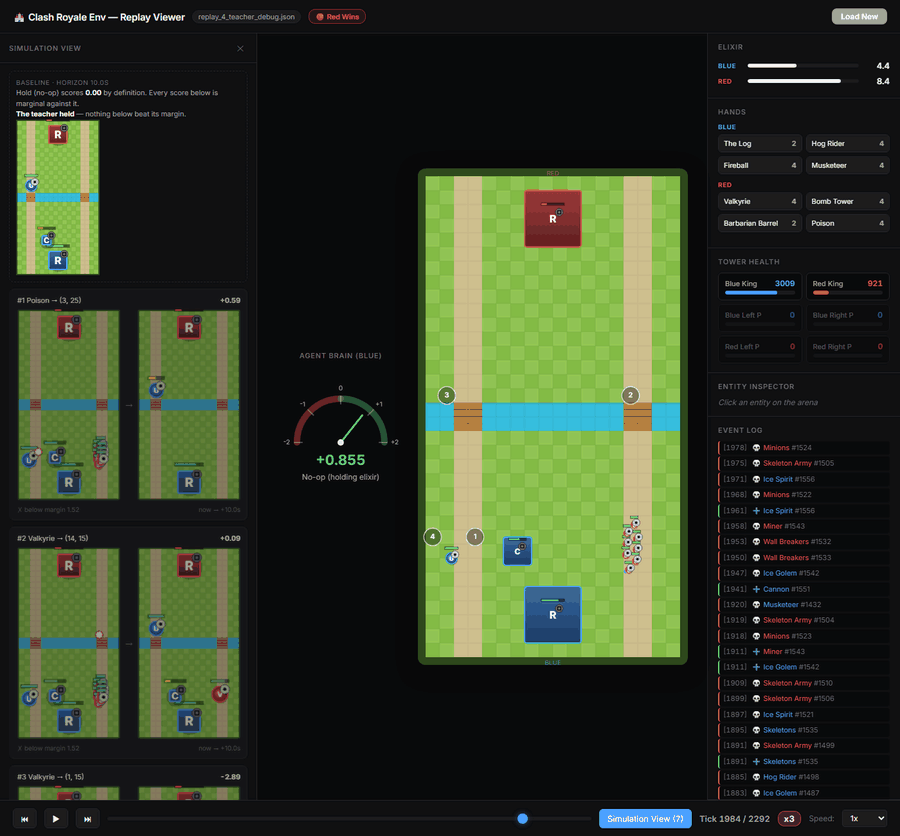
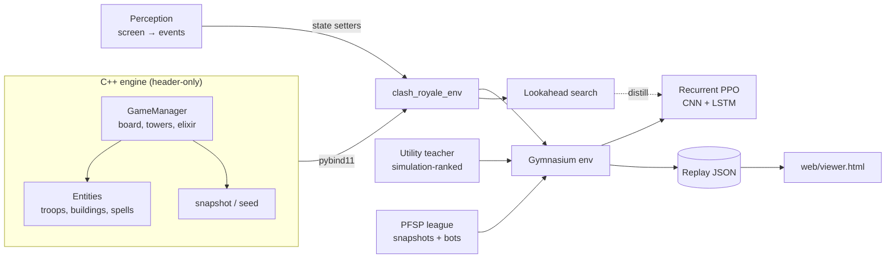

<div align="center">

# ClashRoyaleEnv

**A fast, deterministic Clash Royale battle engine in C++, with Python bindings, a recurrent PPO agent, lookahead search, and a computer-vision bridge to the real game.**

[](LICENSE)


[](https://github.com/itzik123/ClashRoyaleAi/actions/workflows/cpp-tests.yml)



<sub>The replay viewer's <b>Simulation View</b>. The opponent (red) plans by simulation. Every second it scores each candidate play by running the match 10 seconds forward inside the engine. The left panel shows each candidate's placement now and the board it predicts afterwards, and the numbered rings on the arena mark the same candidates. Blue is the PPO agent.</sub>

**The story in 87 seconds.** Unmute for the voiceover.

https://github.com/user-attachments/assets/9508d054-0a50-489f-ba2a-3595480b8a20

<sub>Music: <a href="https://incompetech.filmmusic.io/song/3875-hiding-your-reality/">"Hiding Your Reality"</a> by Kevin MacLeod (incompetech.com), licensed under <a href="https://creativecommons.org/licenses/by/4.0/">CC BY 4.0</a>. Edited: trimmed, faded and mixed under the voiceover.</sub>

</div>

---

## Why

You can't speed up the real game, and it has no API. Reinforcement learning
needs millions of games. ClashRoyaleEnv rebuilds the battle from the ground up
as a headless simulator. It plays a full match in about **10 ms on one laptop
CPU core**, roughly **20,000× real time**. It can also fork any position in
**7–20 µs** to look ahead.

The engine is the core of the project. On top of it sit a complete RL training
stack, a search-based opponent, and a perception pipeline. That pipeline reads
a live match off the screen and replays it inside the engine.

## Features

**Engine** (`include/`, `src/`)
- **132 cards and 41 Evolutions**: troops, buildings, spells, spawners,
  Champions and their abilities, death effects, knockback, slows, stuns and
  rolling spells.
- **Real-game timing**: 10 ticks per second, deploy time, King Tower
  activation, and 1×/2×/3× elixir phases on the real schedule.
- **Movement speeds calibrated against recorded real matches**, and
  cross-checked by two other independent methods.
- **Deterministic**: the same inputs always give the same match. `seed()`
  fixes the opening hand, and `snapshot()` forks a match for lookahead or
  paired A/B tests.
- **Header-only C++17**, exposed to Python through pybind11.
- **715 Catch2 test cases** covering combat, pathing, targeting, placement
  rules and match resolution.

**Learning** (`python_ai/`)
- A [Gymnasium](https://gymnasium.farama.org/) environment with a
  13,977-float observation. It covers a 21-channel board grid, the hands and
  elixir, and a **record of which cards the opponent has played**, which
  makes card counting learnable.
- **Recurrent PPO** (CNN + LSTM, 1.85M parameters). Actions are chosen in two
  steps: first a card, then one of 612 placement cells, with per-card
  legality masks.
- **Curriculum against a search-based teacher.** The opponent proposes
  plays by rules and ranks them by simulating each one forward. It pilots
  **16 real ladder meta decks**. Difficulty comes from how far ahead it
  looks, not from an elixir handicap.
- **Self-play league** with prioritized fictitious self-play (PFSP): the
  agent plays frozen past versions of itself and four scripted bots, and
  gets Elo ratings.
- **Decision-time search and expert iteration**: roll the top candidate
  actions forward in the engine and pick the best, then distill those
  choices back into the policy.

**Perception** (`perception/`)
- Reads a live or recorded match from the screen: arena calibration,
  elixir, the clock, and your hand and card cycle.
- Drives the simulator as a **state estimator**. Vision detects events;
  the deterministic engine works out everything else.

**Tooling**
- A **replay viewer** in one HTML file (`web/viewer.html`) with tower
  health, hands, an event log, an entity inspector, and the agent's value
  estimate. Its **Simulation View** shows the teacher's candidate plays and
  the board it predicted for each. It works offline.
- Standalone C++ audit tools (`tools/audit/`) that measure engine behaviour
  directly: pathing stalls, sight ranges, spawn speeds and collision
  performance.

## Quick start

### Requirements

- Windows 10/11 with **Visual Studio 2022** and the *Desktop development with C++* workload
- **Python 3.11**. The compiled extension is built for the 3.11 ABI.
- Git and an internet connection. CMake fetches pybind11 and Catch2.

> The engine is standard C++, and its test suite has also been built with
> g++ under WSL. Linux and macOS builds of the Python extension are
> [on the roadmap](#roadmap).

### Build

A single script installs Python 3.11 if it's missing, creates the virtual
environments, configures CMake, builds the extension and the test suite, and
runs both test suites:

```powershell
git clone https://github.com/itzik123/ClashRoyaleAi.git
cd ClashRoyaleAi
powershell -ExecutionPolicy Bypass -File tools\setup_dev_env.ps1
```

This produces `python_ai/clash_royale_env.pyd` and
`build_python/Release/ClashRoyaleTests.exe`.
The script's header documents flags for skipping steps, such as `-SkipTests`.

### Use the engine directly

```python
import python_ai                      # puts the compiled engine on sys.path
import clash_royale_env as cr

deck = [15, 6, 25, 40, 24, 72, 33, 7] # 2.6 Hog Cycle
env = cr.ClashRoyaleEnv(deck, deck, max_ticks=3600)
env.seed(0)

print(env.get_hand())                 # card ids in hand, e.g. [24, 7, 72, 40]
print(cr.get_card_info(15))           # {'name': 'Hog Rider', 'cost': 4.0, ...}

result = env.step(card_index=0, target_x=3.0, target_y=14.0)  # play slot 0 at the left bridge
print(len(result.observation), result.reward, result.done)

branch = env.snapshot()               # fork the match
for _ in range(20):
    branch.step(4, 0.0, 0.0)          # slot 4 = no-op; the live match is untouched
```

### Use the Gymnasium environment

```python
from python_ai.envs.gym_wrapper import MicroRoyaleEnv

env = MicroRoyaleEnv()                # 2.6 Hog Cycle vs. the utility teacher
obs, info = env.reset(seed=0)
done = False
while not done:
    action = env.action_space.sample()
    obs, reward, terminated, truncated, info = env.step(action)
    done = terminated or truncated
```

### Train an agent

```powershell
$env:CLASH_DECK = "hog rider,musketeer,cannon,ice golem,skeletons,ice spirit,the log,fireball"
python_ai\venv\Scripts\python.exe -m python_ai.trainers.train
```

Training logs to TensorBoard under `runs/` and writes replays to `replays/`.
To watch a replay, open `web/viewer.html` in a browser and drop a replay JSON
onto it. The full operator guide, including monitoring and the phase-2
handoff, is in [`docs/runbooks/FINAL_RUN_RUNBOOK.md`](docs/runbooks/FINAL_RUN_RUNBOOK.md).

### Run the tests

```powershell
.\build_python\Release\ClashRoyaleTests.exe                          # C++: 715 cases
python_ai\venv\Scripts\python.exe -m pytest python_ai\tests -q       # training stack
perception\.venv\Scripts\python.exe -m pytest perception\tests -q    # perception
```

In a healthy C++ run exactly one case fails "as expected". It pins a known
open collision defect, and the runner still exits 0.

## Architecture



## Results so far

All numbers are measured, and each comes with the conditions it was measured
under. The complete record, including the reversals, is in
[`docs/DECISIONS.md`](docs/DECISIONS.md).

| Experiment | Result |
|---|---|
| **1-ply lookahead search** vs. the greedy policy (160 paired matches, built-in heuristic opponent at 1.5× elixir, Aug 2026, earlier engine version) | win rate **0.625 → 0.944**, +0.319 (95% CI +0.24 to +0.40, p = 5.6e-12) |
| **Distilling search back into the policy** (value-distribution targets + DAgger, 1,600 paired matches, Aug 2026) | **+0.045** win rate (95% CI +0.013 to +0.077, p = 0.007) |
| **Engine speed** (20 seeded random-play matches, one core of an i5-13420H laptop, Sep 2026) | **~5 µs per tick** (3.3–8.5 µs as the laptop's clock varies), about 10 ms per full match; forking a match takes 7–20 µs |

## Project status

This is an active research project. **The engine and tooling are the mature
part. The agent isn't strong yet** and doesn't beat competent human players.
The PPO agent is being retrained from scratch on a new deck, after a full
audit of the reward function and curriculum. Perception reads the elixir bar
and your own hand from live gameplay. Detecting the opponent's placements is
blocked until more recordings are available.

Every release from v0.1.0 onward, with what changed and whether it affects
checkpoints, is listed in [`docs/CHANGELOG.md`](docs/CHANGELOG.md).

### Roadmap

- [ ] Cross-platform wheels (`pip install`) for Linux and macOS
- [ ] Card data in a data file, so balance updates don't require C++ changes
- [ ] Crown Tower damage reduction for spells
- [ ] Opponent placement detection in `perception/`

## Repository layout

| Path | Contents |
|---|---|
| `include/`, `src/` | The C++ engine and its pybind11 bindings |
| `tests/` | C++ Catch2 test suite |
| `python_ai/` | Training stack: `envs/`, `models/`, `rl/`, `trainers/`, `opponents/`, `search/`, `rewards/`, `eval/` |
| `perception/` | Screen capture → game events → simulator state |
| `web/viewer.html` | Replay viewer |
| `tools/` | Environment setup and C++ audit tools |
| `docs/` | Design specs, the decision log, runbooks and measurements. Start at [`docs/README.md`](docs/README.md) |

## Contributing

Issues and pull requests are welcome. Read
[`CONTRIBUTING.md`](CONTRIBUTING.md) for setup, tests and the rules for engine
changes. A good place to start is the list of
[good first issues](https://github.com/itzik123/ClashRoyaleAi/issues?q=is%3Aissue+is%3Aopen+label%3A%22good+first+issue%22),
and questions and ideas are welcome in
[Discussions](https://github.com/itzik123/ClashRoyaleAi/discussions).

## License

Released under the [MIT License](LICENSE).
`perception/clashroyalebuildabot/` is vendored from
[Clash Royale Build-A-Bot](https://github.com/Pbatch/ClashRoyaleBuildABot)
and keeps its own MIT license.

## Disclaimer

This content is not affiliated with, endorsed, sponsored, or specifically
approved by Supercell and Supercell is not responsible for it. For more
information see [Supercell's Fan Content Policy](https://supercell.com/en/fan-content-policy/).

ClashRoyaleEnv is a research simulator. Automating play on a real Clash Royale
account breaks Supercell's Terms of Service.
