<div align="center">

# ClashRoyaleEnv: Learning Clash Royale in a Deterministic Simulator

**A technical report on the engine, the agent, the search-based teacher, and what ten weeks of measurements showed**

Itzik Katz · ClashRoyaleEnv project · Draft, September 2026

[Repository](https://github.com/itzik123/ClashRoyaleAi) · [Decision log](DECISIONS.md) · [Changelog](CHANGELOG.md)

</div>

---

> **Status: complete draft, 2026-09-24.** All sections and figures are in
> place. Every figure is an SVG with light and dark variants, regenerated by
> `tools/figures/` from data committed in `docs/results/figures/data/`; each
> caption says whether it was *measured for this report* or *re-plotted from
> recorded values*. Every number traces to the decision log, the changelog, a
> harness in `python_ai/eval/`, or a measurement made for this report and
> labelled as such.

### Conventions used throughout

- **Every number is measured.** Each figure traces to an entry in
  [`DECISIONS.md`](DECISIONS.md), [`CHANGELOG.md`](CHANGELOG.md) or a harness in
  `python_ai/eval/`. Where a claim was later revised, we report the revision.
- **Regime tags.** The engine changed roughly weekly, and many changes affected
  gameplay. Win rates are **not comparable across a gameplay-affecting change**.
  Each result is therefore tagged with its regime: engine version, deck and
  checkpoint. Findings about mechanisms usually transfer across regimes, but
  magnitudes do not.
- **Statistics.** Comparisons are **paired**: both arms play from the same
  engine snapshot or the same seeded opening. We report the paired mean
  difference with a bootstrap 95% CI and an exact sign test (`eval/stats.py`).
  Win rates without a CI are point estimates and are labelled as such.
- **Board coordinates.** A cell is `(x, y)` on the 18 × 34 grid. `y = 0` is the
  agent's own back row, the river spans `y ∈ [15.5, 17.5)`, and the bridges sit
  at `x = 2.5` and `x = 14.5`.

---

## Contents

- [Abstract](#abstract)
- [1. Introduction](#1-introduction)
- [2. Environment & Engine](#2-environment--engine)
- [3. Neural Network Architecture](#3-neural-network-architecture)
- [4. Training Methodology](#4-training-methodology)
- [5. Emergent Behaviours](#5-emergent-behaviours)
- [6. Lessons Learned & Failures](#6-lessons-learned--failures)
- [7. Limitations & Future Work](#7-limitations--future-work)
- [8. Conclusion](#8-conclusion)
- [Acknowledgments](#acknowledgments)
- [References](#references)
- [Appendices](#appendices)

---

## Abstract

Clash Royale is a real-time, two-player strategy game with hidden
information: each side's hand and elixir bar are secret. Actions combine a
discrete choice (which card) with a spatial one (where to play it). The real
game can't be sped up, has no API, and can't be forked, so reinforcement
learning can't run against it directly.

We present **ClashRoyaleEnv**, which rebuilds the battle as a simulator and
trains an agent inside it. It has four parts:

- A **deterministic, header-only C++17 battle engine** (132 cards, 41
  Evolutions) exposed through pybind11. It plays a full match in **~10 ms on
  one laptop core** (~20,000× real time), forks any position in **~7 µs**, and
  is calibrated against recorded real matches.
- A **recurrent PPO agent** (CNN + LSTM, 1.85 M parameters used for acting)
  that chooses a card and then one of 612 board cells, with legality masks.
- A **search-based teacher** that ranks rule-proposed plays by simulating
  each one forward. It forms an 11-rung curriculum over 16 real ladder decks.
- A **perception bridge** that drives the engine from screen captures as a
  state estimator.

The main contribution is empirical and methodological. Over ten weeks of
measurement we find that the agent's most striking behaviours were **authored
by the engine's physics, the reward, the architecture, the optimiser's
regularisers or the search's world model**, not by anything the agent learned
about the game. The behaviours: parking its defensive building behind its own
King Tower, never casting Fireball, refusing to attack, and a lookahead that
learns to wait. We show how engine-scored counterfactuals, conditional
statistics and paired controls told these causes apart.

Headline measurements:
- A missing one-second deploy time moved the value of an escorted push from
  **−73.7 to +448.5** tower HP.
- One-ply search added **+0.319** win rate against a heuristic opponent
  (p = 5.6e-12), but **−0.31 to −0.53** against the teacher, which simulates
  forward itself.
- Distilling search's value distribution into the policy added **+0.045**
  (p = 0.0074).

We document the full failure record as a practical guide, including twelve
aggregate metrics that hid a collapse and 23 mechanisms that switched off
silently. The agent is not yet strong. The engine and the methodology are the
mature contributions.

---

## 1. Introduction

### 1.1 Motivation

Clash Royale is a compact but demanding testbed for reinforcement learning.
A match is a real-time duel of about three minutes, plus overtime.

- **Partial information.** A player sees every card the opponent plays, but
  not their hand or their elixir bar.
- **A two-part action.** Which of four cards to play, and where on an
  18 × 34 grid.
- **A shared resource.** Elixir regenerates on a clock that speeds up late in
  the match, so every action is also an investment decision.
- **Deckbuilding.** The metagame of decks means any agent will face opponents
  whose strategy it has never seen.

The obvious approach is to learn from the real game through the screen, and
that is where the closest prior work sits (§1.3). It gets real-game
grounding and pays for it in data: the game runs in real time, can't be
paused, reset or forked, and every training episode is a human-length match.

We took the other road and **rebuilt the battle as a simulator**. That road
has its own price. The simulator has to be *calibrated* to mean anything
(§2.3). And the agent may learn the simulator rather than the game. That
second risk is the main theme of this report. Much of what follows is the
record of an agent faithfully exploiting whatever the system actually
rewarded, and of the methodology needed to tell that apart from learning.

### 1.2 Contributions

1. **A fast, deterministic, forkable Clash Royale engine** (§2): ~5 µs per
   tick, a 7 µs snapshot that stays bit-identical to its parent under the same
   actions, calibrated against 8 recorded real matches and Supercell's exported
   card table. Every calibration finding and every known divergence is
   documented.
2. **A complete learning stack** (§3–§4): a recurrent actor-critic with an
   autoregressive, masked action space; PPO with per-head adaptive entropy; a
   reward whose every term is justified by a measurement; a search-based
   teacher whose difficulty is *lookahead* rather than an elixir handicap; and
   a PFSP league.
3. **Six case studies in emergent behaviour** (§5). In each, a striking
   behaviour turned out to be authored by one of **five layers** (engine,
   reward, architecture, optimiser, world model) rather than learned about the
   game, together with the measurements that attributed it.
4. **A measurement protocol and a failure taxonomy** (§5.1, §6): engine-scored
   counterfactuals as the standard of evidence for a claim about behaviour;
   twelve aggregates that hid a collapse; 23 silent mechanisms; 20 measurement
   traps; and a registry of 23 negative results, so that nobody has to pay for
   them twice.
5. **Everything open source** under the MIT license, including the 715-case
   engine test suite, 20 standalone audit instruments, and the decision log
   every number in this report is drawn from.

### 1.3 Related work

**Clash Royale agents.** The closest work is **KataCR** (Wu et al., 2025), a
*non-embedded* agent that plays the real game through the screen:

- **Perception.** YOLOv8 detectors (two or three combined, 150 classes)
  trained on a *generative* dataset built from 4,654 sprite slices, plus OCR
  for text.
- **Decision model.** StARformer and Decision Transformer models trained
  **offline** on **105 expert episodes** against the game's built-in AI.
  That is 113,981 frames, of which only 4.01% contain an action.
- **State and action.** A grid of 18 × 32 × 15 features built from
  detections; an action is a card index plus a grid position.
- **Result.** The best model (StARformer, three layers) won **5%** of 20
  games against the built-in AI rated 8000.

Its stated limitations are a fixed deck, the human effort of building offline
datasets, and the need for *online* RL.

ClashRoyaleEnv is close to the complement of that design. **Clash Royale
Build-A-Bot** (Pbatch) is a rule-based bot with a detection stack; our
perception module vendors its detector.

**Table 1.1 — KataCR and ClashRoyaleEnv, side by side.**

| | KataCR (Wu et al., 2025) | ClashRoyaleEnv (this work) |
|---|---|---|
| Where the agent plays | The real game, through the screen | Our own simulator; the real game through a perception bridge |
| How it learns | Offline RL (StARformer, DT) on expert replays | Online PPO, a search-based teacher, a PFSP league; search and distillation |
| Where the data comes from | 105 human expert episodes | Generated by simulation, ~1,000 episodes per hour on one CPU |
| State | 18 × 32 × 15 grid from detection and OCR | 21 × 34 × 18 channels plus scalars and the opponent's card cycle, exact from the engine |
| Action | Card index plus grid position | Card (or wait), then one of 612 cells, with legality masks |
| Main evaluation | 20 games against the built-in AI | Paired A/B tests on engine snapshots; teacher and league; engine-scored counterfactuals |
| Real-game result | 5% win rate against the built-in AI | One live match won end to end (v1.0.0); not evaluated at scale |

The two designs trade off in opposite directions. KataCR is grounded in the
real game and starved of data. ClashRoyaleEnv has abundant data and has to
*earn* its grounding through calibration. Both converge on one structural fact:
**action is sparse**. KataCR's 4.01% action frames and our agent's 80–90%
no-op rate describe the same game.

**Large-scale game RL.** AlphaStar (Vinyals et al., 2019) introduced the
league and **prioritised fictitious self-play (PFSP)**, both used in phase 2.
It also found its supervised stage load-bearing, which is why human
demonstrations are on our roadmap (§7.4). OpenAI Five (Berner et al., 2019)
annealed γ to control early variance; we measured no variance to control at
γ = 0.999 (§4.3). Our search-then-distil pipeline follows **Expert
Iteration** (Anthony et al., 2017) and AlphaZero (Silver et al., 2017, 2018),
with DAgger (Ross et al., 2011) for the student's own state distribution. We
find, as AlphaZero's use of visit distributions suggests, that distilling the
*value distribution* works where distilling the argmax does not (§5.5).

**PPO and its implementation details.** We use PPO (Schulman et al., 2017)
with GAE (Schulman et al., 2016). Two well-known implementation guides
(Engstrom et al., 2020; Huang et al., 2022) motivated checks that we then
measured as unnecessary *here*; §3.6 records them. The per-head entropy
controller follows SAC's automatic temperature tuning (Haarnoja et al., 2018).

**Reward shaping and specification gaming.** Potential-based shaping (Ng et
al., 1999) is policy-invariant only with the discount kept in the form. We keep
it, and we document where our terms deliberately break invariance and why
(§4.3). The degenerate behaviours in §5 are instances of what Amodei et al.
(2016) call reward hacking and Krakovna et al. (2020) call specification
gaming. The contribution here is attribution: in a deterministic, forkable
simulator, each instance can be traced by counterfactual to the layer that
authored it.

**Architectural artifacts.** The period-4 placement bias in §5.2 is the
checkerboard artifact of transposed convolutions (Odena et al., 2016),
appearing in a policy head rather than an image generator.

### 1.4 How to read this report

**Conventions.** See the box at the top: every number is measured; each
result carries a regime tag (engine version, deck, checkpoint); comparisons are
paired, with bootstrap CIs and exact sign tests. **Win rates are never compared
across a gameplay-affecting change**, and there were at least eight such
changes in under six weeks (§6.5).

**Table 1.2 — Where to find what.**

| If you want… | Read |
|---|---|
| The engine, its speed and its fidelity | §2 (Tables 2.3–2.6) |
| The network and its history | §3 |
| PPO, the reward, the teacher and the curriculum | §4 |
| Why the agent behaves as it does | §5, starting with Table 5.14 |
| What went wrong and what it cost | §6 |
| What is still missing | §7 |
| Hyperparameters, the harness behind each table, the observation layout, the decks | Appendices A–D |

---

## 2. Environment & Engine

Everything in this report runs on one piece of infrastructure: a
**deterministic, headless Clash Royale battle engine** written in C++17
(~9,000 lines of headers) and exposed to Python through pybind11 (`src/bindings.cpp`,
258 lines). The PPO agent trains inside it, the teacher and the search plan by
forking it, and the perception bridge uses it as a state estimator for real
matches. The learning stack depends on four properties of the engine, and this
section covers each one with the measurement behind it.

**Table 2.1 — What the learning stack needs from the engine.**

| Property | Why it matters | Measured (2026-09-24 unless noted) |
|---|---|---|
| **Speed** | RL needs millions of matches, and every teacher decision runs several simulated rollouts | **~5 µs per tick**, ~10 ms per full match; 18,000–20,000× real time (§2.6) |
| **Determinism** | Paired A/B tests, reproducible failures, a zero-divergence perception control | The same seed twice gives an identical final state; a different seed gives a different one |
| **Forkability** | Lookahead search, teacher rollouts, paired openings | `snapshot()` **6.9 µs**; a fork driven with identical actions stays **bit-identical** for 40 decisions |
| **Fidelity** | A policy learned here should mean something in the real game | Calibrated against 8 recorded matches and Supercell's exported card table (§2.3) |

### 2.1 Architecture

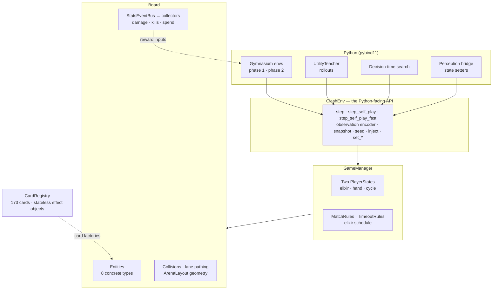

<p align="center"><sub><b>Figure 2.1.</b> Engine layering. Only <code>ClashEnv</code>
is bound to Python. The statistics bus is what the reward reads (§4.3). The
card registry builds entities from data plus stateless effect objects, which
is what makes a snapshot cheap (§2.5).</sub></p>

**Entities.** The hierarchy has **eight concrete types**: `MeleeTroop`,
`RangedTroop`, `BuildingTargeter`, `RangedBuildingTargeter`, `AreaSpell`,
`Projectile`, `Tower` and `Building`. `Entity`, `CardEntity`, `CombatEntity`
and `Troop` are abstract or never instantiated. Card-specific behaviour is
not written as subclasses. It is **composed** from five effect interfaces
(on-hit, on-death, periodic, on-damage-taken, ability), and every one of them
declares `apply` as `const`. A search of every file that defines or uses them
finds no `mutable` and no `const_cast`. The effects are stateless strategy
objects, so copies of the world can share them. That single design property is
most of why §2.5 was cheap to build.

**Cards.** `CardRegistry.h` holds 132 playable cards and 41 Evolutions, 173
entries in all, synced to the live game, including all eight Champions and the
Hero variants. There are no card levels. Evolutions reuse the base card's name
verbatim (id 1 and id 128 are both "Archers"), so a card is never identified
by its name alone.

**The tick.** `GameManager::step()` advances the world by one tick in a fixed
order:

**Table 2.2 — One engine tick.**

| # | Stage | Note |
|---|---|---|
| 1 | Advance the clock; read the elixir phase once | Both players read the same phase |
| 2 | Regenerate elixir for both players | `0.035 × phase` per tick, capped at 10 |
| 3 | Player ticks | Hand-slot cooldown: a slot is locked for 20 ticks after it cycles |
| 4 | Commit queued spawns | `inject` and every spawn *queue*; nothing appears mid-update |
| 5 | Update every living entity | Targeting, movement, attacks, effects, deploy timers |
| 6 | Apply elixir grants (Elixir Collector) | Same cap |
| 7 | Commit spawns, resolve collisions | Buildings never move; this is enforced centrally |
| 8 | Evaluate match rules | A crown lead at 3:00, the first crown in overtime, or a King's death ends the match |
| 9 | Sync Champion cooldowns, remove the dead | Cooldowns sync before the dead are erased, so a Champion that died this tick keeps its final cooldown |

Stage 4 has a consequence for tools: `inject()` places nothing until one tick
runs. Measured immediately after an `inject`, the observation shows 0.0 enemy
mass; after one tick it shows 0.399. A harness that injects and then reads the
board without stepping is looking at an empty board.

### 2.2 Timebase and economy

**Table 2.3 — Timing and economy, with where each value comes from.**

| Quantity | Value | Source |
|---|---|---|
| Ticks per second | **10** | Derived, not assumed. `attackCooldown` is stored in ticks and published in seconds: Archers 9 / 0.9 s, Knight 12 / 1.2 s, Hog Rider 16 / 1.6 s. 132 rows agree on a single ratio. |
| Decision rate | 1 per 10 ticks | `skip_frames = 10`, a stated ceiling (§7) |
| Elixir regeneration | 0.035 per tick = 2.857 s per elixir | The real game is 2.80 s, *measured* off the recordings. The ~2% gap is kept deliberately, because perception's missed-placement alarm uses the real rate. |
| Elixir phases | 1× → 2× at 2:00 (tick 1,200) → 3× at 3:00 (tick 1,800) | The real schedule. Before this change the economy was starved: mean agent elixir 2.16, P(≥ 9) = **0.0%** over 4,229 decisions. |
| Deploy time | 10 ticks, for troops and buildings | Absent until 2026-08-19. Its effect on attacking is the subject of §5.4. |
| King Tower | Asleep until damaged, or until one of its own Princess Towers falls | Absent until 2026-08-21. A lone Hog then deals **+951** tower damage (+75%). |
| Match end | King destroyed; a crown lead at 3:00; the first crown in overtime; at the time limit, `TimeoutRules` | The timeout tiebreak uses *absolute* weakest-tower HP (the real game uses fractions), a deliberate and documented divergence |
| Tower HP | Princess 2,534 · King 4,008 | Fixed at one tower level; perception converts real readings to fractions |

Two rows had consequences that reached well beyond the engine.

**The economy.** Elixir was flat at 1× for the project's first seven weeks, so
the simulated six minutes were really the opening two minutes of a real match,
stretched. Over 4,229 decisions neither side's bar ever reached 9, because both
spent every drop as it arrived. That is the evidence that justified the change:
income was the binding constraint. Had the bars been pooling near 10, the
constraint would have been decision-making, and the change would have been
refuted.

The same change exposed a latent defect in the observation. The spend scalars
were normalised by 140, sized for a flat-1× match, while phased income reaches
about 278. Both scalars would have saturated at 1.0 partway through every
match, blinding the agent to the economy exactly when it decides the game.

**Timeouts.** At the time limit the match used to score 0.0 for both sides,
which taught the agent that running out the clock was neutral. `TimeoutRules`
decides a timed-out match on surviving towers, then on the lower weakest-tower
HP. Only an exact tie is a draw.

### 2.3 Fidelity: calibrated, not assumed

The engine was checked against three external references: 8 recorded real
matches (1920×1080, constant 30 fps), Supercell's exported card-statistics
table, and a professional player's audit of the arena. Table 2.4 lists what
each one found.

**Table 2.4 — Calibration findings.** Every row is gameplay-affecting, and every
win rate measured before it is historical.

| Quantity | What was wrong | Reference | Resolution |
|---|---|---|---|
| **Movement speed** | Troops moved **4–5× too fast**. `speed` is in tiles per *tick*, so the Giant's `0.3` meant 3.0 tiles/s against a real ~0.75. | Three independent methods on the recordings: per-card footage, the Slow:Medium ratio, and a time-scale sweep whose optimum moved **0.2 → 1.0** after the fix | A global scale factor (Aug 7). Matches became ~3× longer. |
| **Speed tiers** | The real game uses five tiers (30 / 45 / 60 / 90 / 120 tiles per minute); the engine had nine ad-hoc values. **104 of 131 troops** were wrong, which no global scale can fix, since scaling preserves ratios. | Supercell's exported table (119 characters, exactly five values) plus footage. The Giant and the Mini P.E.K.K.A., on different tiers, agree on the conversion constant to **1.5%**. | Tier constants. The round-trip check **109 / 109** matches; a first scripted rewrite that edited a helper instead of the card was caught by it. |
| **Spawned units** | 19 spawned units ran about a quarter slower than their own card. The Golemite ran slower than any real tier. | "Does a spawned unit move at the speed of the playable card with the same name?" | A generic test, so a new helper can't reintroduce it |
| **Sight** | Aggro radius was inflated by both hitboxes: a Hog Rider's 9.5 became **10.9** against a Cannon | The published catalogue is centre-to-centre | Strict centre-to-centre, floored at the unit's own attack reach |
| **Sight vs attack** | Measured by different conventions, which left a band where a unit could hit what it couldn't see. A Musketeer at 8 tiles dealt **5,355** tower damage and took **0**. | Invariant: effective sight ≥ effective attack range | One shared function for both comparisons |
| **Arena geometry** | Bridges and Kings were half a tile off. The real river row is `WWBBWWWWWWWWWWBBWW`. | The player's audit; `board_map.cpp` renders the arena *from the live engine* | `ArenaLayout.h`, bound to Python. **Eight** stale copies were found and removed over time (§6.3). |
| **The Log** | Modelled as a static circle 7.8 wide; the real card is a 3.9-wide corridor that rolls 10.1 tiles | Published width and range | A rolling corridor with directional knockback. It reaches the enemy Princess from the bridge by 1.1 tiles, so hit detection is surface-to-surface. |
| **Graveyard** | Dealt **0** tower damage from all 588 legal cells: one Skeleton per 10 ticks against a tower firing once per 10 ticks | The real card: 12 Skeletons, one every 0.5 s | Arrivals now outrun a tower 2:1 |
| **Card behaviour** | Ice Golem slowed with its *attack*, not its death explosion; Ice Spirit half-slowed instead of stunning | Card text | Fixed. Both were in the shipped deck. |

<p align="center">
<picture>
  <source media="(prefers-color-scheme: dark)" srcset="results/figures/fig-2-2-speed-calibration-dark.svg">
  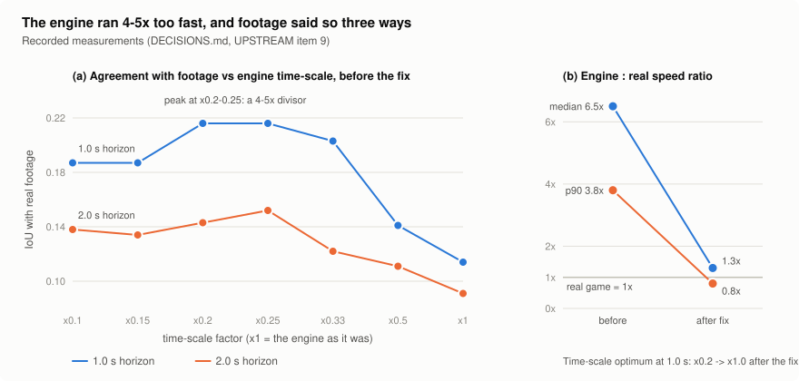
</picture>
</p>

<p align="center"><sub><b>Figure 2.2.</b> Movement-speed calibration. (a) Agreement with real footage (IoU) as the engine's time-scale is varied, before the fix, at the two horizons that can resolve it: the peak at ×0.2–0.25 implies a 4–5× speed error. (b) Engine-to-real speed ratio before and after the fix. <i>Re-plotted from recorded values (DECISIONS.md, UPSTREAM item 9); the post-fix sweep was not archived, only its optimum.</i></sub></p>

**Table 2.5 — Known divergences from the real game.**

| Divergence | Status | Why |
|---|---|---|
| Elixir 2% slow | Kept | Perception's alarm depends on the real rate |
| Timeout tiebreak on absolute HP | Kept | Specified by the audit; documented |
| Rolling spells limited to own half + river | **Kept, and not a real-game rule** | An action-space decision: 53.4% of the agent's Logs were cast on the enemy half, where a roller travels away from everything |
| Spells deal 100% of their damage to Crown Towers (real: Fireball 159 of 688) | **Open**, proposed (UPSTREAM item 29) | A C++ change awaiting sign-off. A Princess Tower falls to 4 Fireballs instead of 16. |
| Units pinned between two buildings can stall | **Accepted**, pinned by a `[!shouldfail]` test | 7 stalls in 342,563 unit-ticks, none near a bridge; the real fix is global path planning |
| No card levels; towers at one fixed level | Kept | Perception converts HP to fractions |
| Projectile speed not recalibrated with movement | Open, unmeasured | — |

### 2.4 Absorbing states and silent defects

A deterministic engine has a failure mode a stochastic one hides: an
**absorbing state**, a position a unit can enter and never leave. Two were
found in the same function.

- **The entry trap (Aug 9).** The waypoint planner classified a unit standing
  exactly on the near bank as still "below", and handed it the point it already
  occupied. The mover refused to move a distance under 0.01. Same position,
  same waypoint, forever. The chance that a step lands in that 0.01 disc is
  about `0.01 / step size`, so the movement-speed fix raised it **5×**, from
  ~3% to ~17%.
- **The exit trap (Aug 20).** The fix guarded the branches for a unit *leaving*
  a bank and missed the branch for a unit *arriving* at the far one. A per-tick
  trajectory sweep of 306 lone crossings found that **~20% of lone ground
  crossings never completed**, with stalls up to 844 ticks. Crowds hid it,
  because collisions nudge units out of the trap. So it was a lone-unit bug,
  which is exactly the "send the Hog to the bridge" case. After the fix, an
  analytic sweep of **8,661,439 board positions** against 8 destinations finds
  zero absorbing states.

These two traps give two general rules. **Two independent copies of "close
enough" are a deadlock waiting for the right step size.** And when a fix of
this shape lands, sweep every branch of the function, not just the one the
reproduction happened to take.

Four more defects of the same kind (silent, plausible-looking, and caught only
by instruments) are worth one line each:

- **One fact, two readers, and a write in between.** A freeze of N ticks
  stopped attacks for N ticks but movement for N − 1, because the two readers
  sampled the counter on either side of its decrement.
- **A Mortar kept its owner's King alive.** Both used the symbol `'R'`, so King
  kills became timeouts. The existing tests built their stand-in King as a
  dummy wearing `'R'`, which is exactly what a Mortar is. *A test double that
  wears the discriminator can't test the discriminator.*
- **Buildings outlived their lifetime** (a Cannon died at 31.0 s, not 30.0),
  because decay was integer subtraction that nothing checked against the clock.
  The one test used HP and lifetime values that divide exactly.
- **Damage to spawned bodies was booked as tower damage** (810 for one Goblin
  Barrel), and it fed both the reward and the teacher.

### 2.5 Snapshot and seeding: determinism as an instrument

**Determinism.** Combat contains no randomness. The only generators are the
opening-hand shuffle and the built-in heuristic opponent, and `seed(s)` seeds
both and re-deals. Verified for this report: a full seeded random-play match
run twice ends in an identical state (tick, all six tower HPs, both sides'
spend), and a different seed diverges.

That property only became usable once every path to randomness was reachable.
For weeks `reset()` shuffled from OS entropy while the harnesses announced
themselves deterministic. It cost one experiment its control: two runs sharing
a seed produced "untreated" arms of 0.475 and 0.537. A later case was
`sample_random_deck`, which drew from a process-global static generator. At
`num_envs = 8` that can only be reproduced for one fixed call order, so a seeded
call now builds a private generator.

**Snapshot.** `env.snapshot()` returns an independent copy of the whole match.
It needed three things, and two of them were traps.

1. **A per-type copy with a throwing default.** The existing `clone()` couldn't
   be reused: it implements the *Clone card* (it sets `hp = 1`) and returns
   `nullptr` by default. A naive "clone every entity" loop would have built a
   board that silently dropped every tower, building, spell and projectile, and
   still looked like it worked.
2. **Remap the one entity pointer.** `Projectile::target` is the only
   entity-pointer member in the hierarchy. Copied verbatim, a projectile in
   flight inside a rollout would damage a unit on the *live* board. The copy
   builds an old-id → new-entity map and remaps it.
3. **Copy the statistics without aliasing them, and without resetting them.**
   The stats collectors are stateful and feed the reward. Sharing them would
   post every hypothetical hit into the live match's statistics. Re-attaching
   fresh collectors fails the other way: a snapshot then reports a match in
   which nobody has dealt damage, so the cumulative tower potential scores
   every candidate as the same huge instant loss. That looks exactly like a
   working search that never prefers anything. Each collector is therefore
   deep-copied.

Verified for this report: a fork driven with the same 40 decisions as its
parent produced **bit-identical observations for both teams** (SHA-256 on the
float arrays). Stepping a fork 300 ticks left the parent's clock and every
tower HP untouched.

**Snapshots also replace seeding for pairing.** Reset once, snapshot, and both
arms of an A/B start from a bit-identical opening. Most of the paired results
in §5 were measured this way.

> **Finding 2.1 — Determinism is a research instrument, not a property to
> advertise.** It made paired A/B tests, snapshot search and a zero-divergence
> perception control possible. Every unseeded path left in the system turned
> into an invalid control somewhere downstream.

### 2.6 Performance

**Table 2.6 — Cost of engine operations**, measured 2026-09-24 through the
Python bindings (Python 3.11, i5-13420H, one core, on battery power with the
Balanced plan). The engine is deterministic, so noise is mostly additive, and
each figure is the minimum over interleaved repeats of the *same* workload,
with the median taken across workloads.

| Operation | Cost | Notes |
|---|---|---|
| One tick, physics and logging (`step_self_play_fast`) | **4.85 µs** | Median over 20 seeded random-play matches of the per-match minimum over 7 repeats |
| One tick, plus both observations built every 10 ticks (`step_self_play`) | **5.63 µs** | 1.14–1.16× the fast step; an identical-arms control read 1.02 |
| One full match (1,870 ticks on average) | **9.1 ms** fast · **10.5 ms** full | **~18,000–20,000× real time** |
| `snapshot()` at tick 600 | **6.9 µs** | 33 µs when first built on 2026-08-11 |
| 10-tick step on a fork | 19.5 µs | |
| `seed()` | 8.0 µs | |
| `reset()` | 83 µs | Includes building the opening observation |
| One observation into Python | 75 µs | The C++ encoder takes 2.7 µs; most of the rest is pybind11 converting 13,977 floats into a Python list |

These are **absolute numbers on a thermally and power-limited laptop**, and
they moved with clock state. Across three runs on the same day, the median
cost of the full step ranged from 3.3 to 8.5 µs per tick. In the two runs
where the arms were interleaved, the full/fast ratio held at 1.14–1.16 against
an identical-arms control of 1.02. So quote the ratios with
confidence and the absolute figures as a range. The README's "about 6 ms per
match, ~27,000× real time" falls inside that range at the fast end.

**Where the cost used to be.** Two profiling passes found that most of the
engine's time was not simulation:

- **The observation encoder** measured 63× the physics tick it describes. It
  was allocating twice per call and writing a 185-wide one-hot with 185
  branching `push_back`s. After the fix: **69.4 → 2.7 µs**. A checksum variant
  that reads every element measured 9.8 µs, which rules out the compiler having
  optimised the writes away.
- **Teacher rollouts** built **1,000,152** observation vectors and read
  **51,566** of them, a 19.4 : 1 build-to-read ratio. A rollout chunk spent
  more time describing the board to nobody than simulating it.
  `step_self_play_fast` shares the tick loop with `step_self_play` (the only
  changed line is the return statement) and skips both observations. That
  saved 9.7% of every teacher decision (23 of 24 paired trials, p = 3e-06), and
  the teacher's choices stayed action-identical in 12 of 12 configurations.
- **Collisions** were quadratic in board size and made four virtual calls per
  pair to learn facts that are constant within a tick. Hoisting them gave
  **2.4–4.4×**, growing with population. Old and new answered identically on
  all **8,572** board cells swept.

**Simulation is not the bottleneck.** A 20-tick rollout costs about 1/150 of
one network forward pass, and 87% of training wall clock is the PPO update.
The engine is fast enough that search and the teacher are limited by *scoring*
candidates, not by simulating them (§4.7).

<p align="center">
<picture>
  <source media="(prefers-color-scheme: dark)" srcset="results/figures/fig-2-3-tick-cost-dark.svg">
  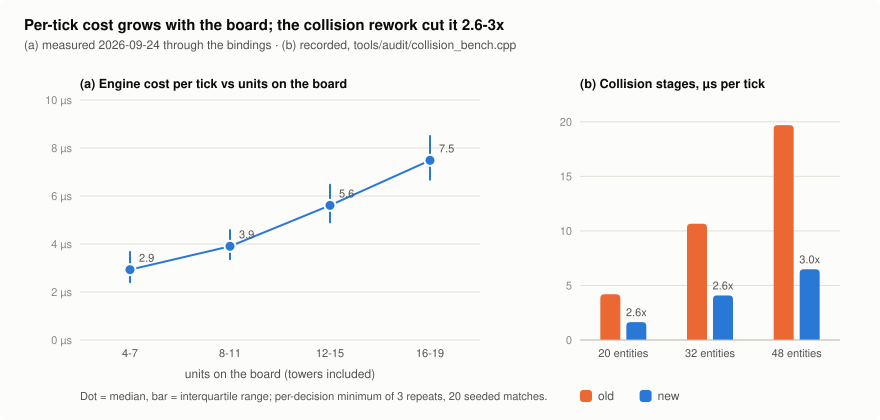
</picture>
</p>

<p align="center"><sub><b>Figure 2.3.</b> (a) Engine cost per tick against units on the board, <i>measured for this report</i>: 20 seeded random-play matches, per-decision minimum of 3 repeats; dot = median, bar = interquartile range. (b) The two collision stages before and after the hot-path rework, <i>recorded</i> (<code>tools/audit/collision_bench.cpp</code>).</sub></p>

### 2.7 Verification: what a test suite can and cannot see

The engine has **715 Catch2 test cases** (8,171 assertions, 41 test files).
Exactly one is expected to fail: `[!shouldfail]` pins the accepted collision
wedge, so the suite stays green while the defect stays executable. CI builds and
runs the suite with MSVC on every engine change.

A green suite was repeatedly **not enough**, and the failures fall into three
categories that decide what else needs building:

**Table 2.7 — Defects the suite could not see, and the instrument that found each one.**

| Category | Example | Why the suite was blind | Instrument (`tools/audit/`) |
|---|---|---|---|
| **Data, not mechanism** | Movement 4–5× too fast; 104 of 131 troops on wrong tiers | All 504 cases passed before *and* after. Tests build units with literal speeds and cover the movement *mechanism*, not the registry's *data*. | `spawn_speed_audit` (spawn every card, read the speed off what arrives) |
| **Trajectory, not end state** | The bridge exit trap, affecting ~20% of lone crossings | The suite asserts end states; this is a property of the path. The existing sweep also tested exactly the complement of where the bug was. | `bridge_audit` (306 per-tick crossings), `waypoint_probe` (8.66 M positions) |
| **A copy outside the physics** | Observation channel 8 showed the bridges wrong in **4 of 18 columns** | Nothing compared the encoder's river row with the movement rule it describes | `board_map`, and a test comparing channel 8 against `clampToBoard` for both teams |

The other instruments work the same way: each measures **behaviour** rather
than reading the source.

- `soak`: 60 randomised full matches, flagging any unit that stands still with
  nothing in range.
- `sight_audit`: generates the 148-card sight catalogue that a test now pins.
- `king_activation_audit` and `pull_range_probe`: measure the Cannon pull
  radius by trajectory deviation. Tower damage can't be used, because decay
  makes it fire at every offset.
- `collision_bench`: puts the old and new implementations in one binary, so the
  comparison can't be confounded by other gameplay changes.
- `verify_pyd.py`: proves the compiled `.pyd` that training loads actually
  carries the current engine.

The spawn-speed audit shows why measurement beats reading the source. A grep
for non-tier speed literals finds 54 and suggests a large gap. The measurement
finds **8 units** off-tier. Most literals land within 1% of a tier by
coincidence, so the first estimate from reading the source was 7× too large.

> **Finding 2.2 — Test the mechanism in the suite, and measure the data and the
> trajectories with instruments.** A unit test proves the code does what its
> author meant. It can't show that the numbers are the real game's, that a
> trajectory never gets stuck, or that a second copy of a fact still agrees
> with the first.

### 2.8 The perception bridge

`perception/` reads a real match off the screen and drives the engine as a
**state estimator**. Vision detects *events* (what was played, where and when),
and the deterministic engine derives everything else. The required bandwidth
is about 20 events per minute, not a full state at 30 fps.

The engine exposes **state setters** for this. Each has a rule that is silent
when broken:

- **`set_tower_hp`** takes a *fraction* times the engine's maximum, never a raw
  reading. Real accounts have different tower levels, so a raw reading is off
  by a different factor per player. It *refuses* `hp ≤ 0`; destroying a tower
  has side effects (the crown, the King's wake-up, lane retargeting) that belong
  to `destroy_tower`.
- **`inject(..., deploy_ticks=0)`** is required for any unit perception can
  already see. Otherwise every re-injected unit gets a fresh deploy second,
  including one that has been walking for six: a standing defensive subsidy
  measured at **317** tower HP.
- **`note_played_card`** records a play for the opponent-cycle observation.
  `inject` deliberately places a *body* and doesn't record a play, so without
  this call the cycle channel works in training and is silently empty in
  deployment.
- **`set_hand_for_team`** returns a bool and can refuse. The teacher's slot
  index refers to the mirror's hand and the actuator taps the real one; they
  agree only if this call returned `True`.

**Table 2.8 — Perception status** (from `perception/README.md`).

| Stage | Status | Evidence |
|---|---|---|
| Arena calibration | Passes | Checked against the arena's own rendered tile seams: 0.105–0.224 tiles across all 8 recordings |
| Elixir reader | Passes | Mean confidence 0.990 over 587 samples; regen measures **2.80 s**, matching the real game |
| Clock reader | Passes with gating | 97.1% correct at confidence ≥ 0.7 |
| Own hand and cycle | Passes, running live | **100%** of 120 blind-labelled slot crops; cycle-impossible transitions 62.8% → 0.0% |
| Opponent placement detection | **Blocked on data** | Needs the next recording batch |
| Engine bridge | Done | Zero-error control: divergence identically **0** |
| Live loop | Built, running | 917 ms per iteration within a 1,000 ms budget. First real match won end to end on 2026-08-06 (v1.0.0), at 0.97 decisions/s with none of 49 over budget. |

The bridge exists for research: validating simulator fidelity against real
footage, and eventually collecting human demonstrations. **Automating play on
a real Clash Royale account breaks Supercell's Terms of Service**, and no
result in this report depends on doing so.

---

## 3. Neural Network Architecture

The agent is `MicroRoyaleNet` (`python_ai/models/net.py`), a recurrent
actor-critic. It encodes the board with a CNN and the scalar inputs with a
branched encoder, integrates both over time in an `LSTMCell`, and acts through
two heads in sequence: first a card, then a board cell for that card. A value
head and two auxiliary heads read the same recurrent state.

The network has **1,899,992 parameters**, of which **1,847,822** are used when
choosing an action. Both counts were measured on 2026-09-24 by building the
class as it ships. Every dimension, from board size and channel count to hand
size and section offsets, is read from the engine's bindings when the net is
built, so no layout constant is restated in Python.

Most of the design is a response to a measured defect. This section describes
the network as it stands, then traces the placement head and the auxiliary
heads back through their measured history.

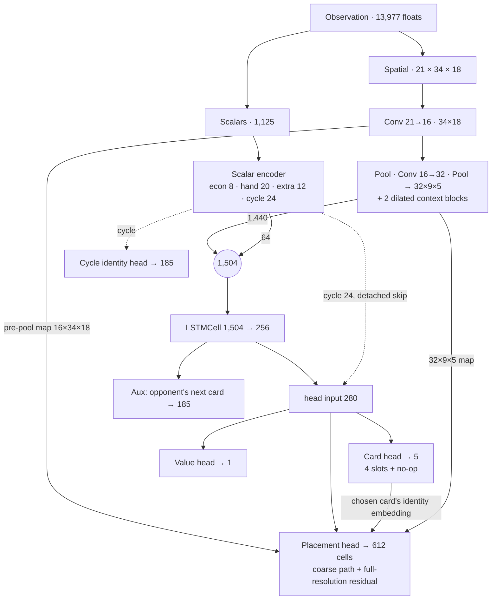

<p align="center"><sub><b>Figure 3.1.</b> <code>MicroRoyaleNet</code>. Solid arrows
carry gradient from the PPO loss. Dotted arrows are detached from it (§3.3,
§3.5). The two heads at the bottom are used only for training.</sub></p>

### 3.1 Observation

The observation is a flat vector of 13,977 floats from
`extractObservationForTeam`: a spatial block followed by scalar sections.

**Table 3.1 — Observation layout.** Offsets are bound constants, not derived in Python.

| Section | Offset | Size | Content | Scale |
|---|---|---|---|---|
| Spatial channels | 0 | 12,852 | 21 channels × 34 × 18 (Table 3.2) | HP fraction; attributes clamped to [0, 1] |
| Own elixir | 12,852 | 1 | current bar | ÷ 10 |
| Hand costs | 12,853 | 4 | elixir cost of each slot | ÷ 10 |
| Hand identity | 12,857 | 740 | 4 × 185 one-hot | — |
| Extra scalars | 13,597 `EXTRA_SCALARS_START` | 10 | match clock · own and opponent cumulative spend · 6 tower HPs · elixir-phase multiplier | ÷ max ticks, ÷ 280, ÷ 4,008, ÷ 3 |
| Opponent cycle | 13,607 `CYCLE_START` | 370 | `seen[c]` and `recency[c]` = exp(−Δt / 200 ticks) over 185 card ids | — |

**Table 3.2 — Spatial channels.** The engine uses one convention throughout:
ally first, then enemy.

| Channel | Content | Rule when a cell holds several units |
|---|---|---|
| 0–3 / 4–7 | Ally / enemy HP fraction: melee, ranged, building-targeter, building | assigned (last write wins) |
| 8 | River and bridges | static |
| 9 / 10 `CH_COUNT` | Units in the cell (÷ 5) | accumulated |
| 11 / 12 `CH_FLYING` | Any flyer present | max |
| 13 / 14 `CH_ANTIAIR` | Can hit air | max |
| 15 / 16 `CH_DPS` | Damage per tick (÷ 60) | max |
| 17 / 18 `CH_RANGE` | Attack range (÷ 12) | max |
| 19 / 20 `CH_SPEED` | Movement speed (÷ 1.5) | max |

Five rules shaped the observation. Each one was learned from a defect.

1. **Show what a human player can see, and nothing more.** A spectator sees
   every card played and knows its cost, but can't see the elixir bar. So the
   encoder gives the opponent's cumulative *spend*, never their current elixir.
   The cycle blocks apply the same test to card identity. The encoder had been
   keeping the sum of card costs and throwing away which cards they were, and
   that summary is precisely the one that destroys cycle information. The
   opponent's hand stays hidden.
2. **Keep the state Markov where the game is.** Until 2026-07-29 the
   observation had no clock, so tick 100 and tick 3,500 with the same board were
   the same input. Once `TimeoutRules` made clock management a real decision,
   part of the critic's error was *structurally* unlearnable rather than just
   undertrained. The elixir-phase scalar follows the same logic: the value of
   holding elixir depends on how fast it will arrive. Tower HP is also given as
   explicit scalars, because in the building channel each tower is a single
   cell that has to survive two max-pools.
3. **Encode attributes, not identities.** A per-cell stack of card-id one-hots
   would cost about 113,000 floats. Twelve attribute channels (count, air,
   anti-air, DPS, range, speed) describe what a unit *does* instead. On the day
   the anti-air channel was added it exposed a registry bug: Musketeer, Wizard,
   Spear Goblins and Ice Wizard could not shoot air, and Musketeer was in the
   shipped deck.
4. **Locate each section by a forward offset.** Five call sites found the
   extra scalars by subtracting from the *end* of the vector. When the cycle
   blocks were appended behind them, two of those sites started reading
   card-recency values as enemy tower HP, which feeds the reward's tower
   potential. Nothing raised an error. The offsets are now bound constants, and
   `observationSize()` is derived from them, so the size and the offsets can't
   disagree.
5. **Mirror by position, then truncate.** Team 1 sees the board flipped. The
   encoder once computed `33 − int(y)` instead of `int(33 − y)`, which shifted
   team 1's whole view by one row. No training metric showed it, because the
   trainee is always team 0. A policy playing an exact copy of itself scored
   **0.598** as team 0, and 0.520 after the fix.

**Table 3.3 — Observation versions.** Each version broke compatibility with
earlier checkpoints, except the last.

| Version | Date | Size | Change |
|---|---|---|---|
| pre-v3 | ≤ Jul 29 | 6,253 | 9 channels, hand, elixir |
| v3 | Jul 29 | 13,606 | 21 channels; clock, spend and tower-HP scalars |
| v4 | Aug 27 | 13,976 | Opponent card-cycle blocks |
| v4.1 | Sep 2 | 13,977 | Elixir-phase scalar. Migrated by zero-padding 120 weights **and their Adam moments**; padding the weights alone gives a file that loads a model and then fails in `optimizer.load_state_dict`. |

**Known limitation.** Channels 0–7 keep one HP value per cell. Measured against
true per-tick entity HP, a swarm deck hides **21.3%** of troop HP (2.6 Hog
Cycle: 0.8%). Writing the max instead of the last value would recover only
about 2.3 points of that, because the loss comes from having one value per
cell, not from the write order. A proper fix is a summed-HP channel, which is a
separate observation change (§7).

<p align="center">
<picture>
  <source media="(prefers-color-scheme: dark)" srcset="results/figures/fig-3-2-observation-dark.svg">
  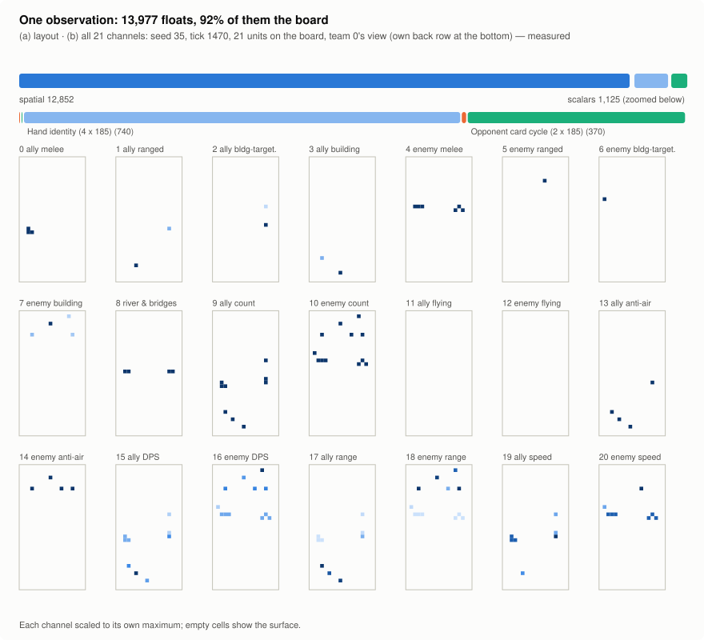
</picture>
</p>

<p align="center"><sub><b>Figure 3.2.</b> (a) The 13,977-float observation by section. (b) All 21 spatial channels of one real state, the busiest board among 40 seeded random-play matches, in team 0's view. <i>Measured for this report.</i></sub></p>

### 3.2 Action space

An action is the pair (card, cell), sampled **autoregressively**:
`π(card | s) · π(cell | s, card)`.

- **The card head** has 5 logits: the 4 hand slots plus a **no-op** (wait and
  bank elixir).
- **The placement head** is one categorical over all 612 cells of the board. It
  is conditioned on the recurrent state and on an identity embedding of the
  chosen card. That embedding is read from the hand one-hot, not from the slot
  index, because cards rotate through the slots and a per-slot embedding could
  never learn a per-card placement.

The placement distribution is **joint** over cells rather than a product
`p(x) · p(y)`. A factorised head can't express "near the left bridge or in the
back-right corner" without also putting mass on the mixed combinations.

Two masks shape the logits. Both are recomputed from the *stored*
observation at update time, so the rollout and the PPO update can't disagree.
Both use `−inf`: any finite value, however negative, still leaves an illegal
action some probability and some entropy.

**Table 3.4 — Action masks, and the defect each removed.**

| Mask | Built from | Before the mask |
|---|---|---|
| Affordability | Elixir and hand costs in the observation | **74.9%** of steps attempted an unaffordable card and only 11.5% placed one. The engine rejects an unaffordable card silently, so ~87% of stored actions changed nothing and their advantages were pure noise. Rejected actions: 86.8% → **0.0%**. |
| Placement legality | A table built once by querying the engine's `is_valid_placement` (~113,000 calls), for four own-tower states pre-combined into one gather (4 × 186 × 612 bools) | At ep ≈ 45,800, **58.7%** of card choices were rejected by the engine, 94.8% of them on the back row |
| Row rule | Own half for troops; the whole board for spells and deploy-anywhere troops | Fireball couldn't cross the river. Later, the Miner was limited to its own half (242 legal cells instead of 520), and every Evolution had an all-illegal row because the table was built from a card list that excludes Evolutions. |

Cell indices use **truncation**, the engine's own convention. Rounding
instead sends `y = 15.5` to row 16, outside the legal half, where the mask
silently removes it. The mask is validated against the engine's *behaviour*
(was the elixir actually spent?), never against the predicate it was built
from (§6.4).

**Champion abilities** add two binary heads (decline / activate), but only
when the deck contains a Champion. They are masked by the ability's readiness.
In decks without a Champion they used to sample pure noise every tick, which
widened the PPO ratio's variance and spent up to 2 · log 2 = 1.386 nats of the
entropy budget on irrelevant coin flips.

The agent makes **one decision per second** (`skip_frames = 10`). This is a
hard ceiling on timing precision, discussed in §7.

### 3.3 The network

**Table 3.5 — Parameters by module** (measured on the shipped class,
2026-09-24, deck without a Champion).

| Module | Structure | Parameters |
|---|---|---|
| CNN trunk, base | Conv 21→16 (3×3) · MaxPool · Conv 16→32 (3×3) · MaxPool, `ceil_mode` → 32 × 9 × 5 | 7,680 |
| CNN trunk, context | 2 × `DilatedContextBlock` (1×1 32→16, 3×3 d = 2, 1×1 16→32 zero-init) | 6,784 |
| Scalar encoder | econ 48 · hand 930 · extra 132 · cycle 3,752 | 4,862 |
| Card identity embedding | Linear 185 → 16 + a no-op vector | 2,976 |
| **LSTM** | `LSTMCell(1,504 → 256)` | **1,804,288** (95.0%) |
| Card head | 280 → 5 | 1,405 |
| Placement head | context 9,504 · coarse up-path 5,857 · full-res context 2,376 · full-res convs 1,809 | 19,546 |
| Value head | 280 → 1 | 281 |
| *Aux: opponent's next card* | 256 → 185 | *47,545* |
| *Cycle identity head* | 24 → 185 | *4,625* |
| **Total** | acting path **1,847,822** | **1,899,992** |

**A whole-board receptive field.** The base trunk's receptive field is
10 × 10 cells. The bridge is at `y = 16.5` and the enemy King at `y = 30.5`,
14 rows apart. So no single convolutional feature could relate "their win
condition just crossed" to "this is the tower it's walking at". And because
the placement head reads the spatial map directly, the limit applied to the
*action*, not only to the representation.

Two residual dilated blocks run on the pooled 9 × 5 map. There one cell spans
four input rows, so a 3 × 3 kernel at dilation `d` adds `8d` rows of reach:
10 + 16 + 16 = **42 ≥ 34**. Each block's final 1 × 1 convolution is
zero-initialised, so the block starts as an exact identity and a warm-started
trunk is bit-identical to before. The blocks are *appended* to the trunk,
because two callers slice it by index (`cnn_trunk[:2]`) to get the
full-resolution map.

**Table 3.6 — Buying reach on a 9 × 5 map** (forward + backward, batch shape (500, 32, 9, 5)).

| Option | Time | Reach added |
|---|---|---|
| Identity | 0.97 ms | 0 |
| One block, d = 2 | 8.26 ms | 16 rows |
| One block, d = 4 | **43.72 ms** | 32 rows |
| **Two blocks, d = 2** | **14.6 ms** | **32 rows** |
| Doubling trunk width | 2.28× the base trunk | 0 |

A d = 4 block costs 5.3× more than a d = 2 block with the same parameter
count. Padding a 9 × 5 map by 4 makes it 17 × 13, 221 cells against 45, so
~80% of the work is padding. The whole 2026-08-27 architecture change cost
**+14.8%** update time against a ±0.8% noise floor. The network got *smaller*
at the same time, because of the scalar encoder below.

Both pools use `ceil_mode`. Floor mode divides 34 rows into 17 and then 8, and
silently drops the back row behind the King.

**A four-branch scalar encoder.** The scalars used to go through one
`Linear(1124, 64)`: 72,000 parameters, with every output depending on every
input. The problem was *optimisation interference*, not compression. A random
projection of the 370 cycle dimensions into 64 largely preserves them
(Johnson–Lindenstrauss). But in a single dense layer, a gradient step that
improves the hand encoding rewrites the very rows the cycle is read through,
so the cycle representation is perturbed continuously and never converges.

The encoder now has four branches:

- **econ:** elixir and hand costs → 8
- **hand:** the four one-hots through one shared `Linear(185 → 5)` → 20
- **extra:** the 10 extra scalars → 12, an *expansion*, since these inputs
  decide who is winning
- **cycle:** `seen` and `recency` through one shared card projection → 24

The branch widths must sum to 64, which is the LSTM input width minus the
CNN's output. Changing that total reshapes the 1.8 M-parameter LSTM. The new
encoder has 4,850 parameters (4,862 once the phase scalar was added) and runs
at **0.998×** the old one's time.

The test that pins this takes a real optimiser step on a hand-only objective
and checks that the encoder's response to the cycle didn't move. A paired
control *requires the monolithic layer to fail* the same procedure, so the test
can't pass for a trivial reason.

**The recurrent core and the cycle skip.** An `LSTMCell` is stepped manually,
with the hidden state reset at episode boundaries. Truncated BPTT runs over
chunks of 50 decisions, because a card rotation takes about 30 (§4.1). During
the update only the LSTM is recurrent, so the heads run once over all L · B
rows instead of L times over B. That gave **1.82×** on the forward pass and
**2.54×** on end-to-end updates per hour, with a maximum logit difference of
1.1e-08 against float32's machine epsilon of 1.19e-07.

The cycle branch's 24 dimensions are 1.6% of the LSTM's input, and passing
through the LSTM lost most of their card signal (§5.7). So they also bypass
the LSTM: they are **detached** and concatenated to `hx`, which gives a
280-wide input to the card, value and placement heads. The auxiliary
next-card head deliberately reads plain `hx` and never this skip. If it could
read the skip, it would answer from the branch and ask nothing of memory.

**Where the compute goes.** 87% of wall-clock time is the PPO update. Within
it, the trunk takes 43%, the placement head 41% and the LSTM loop 16%
(measured before the context blocks). The convolutional placement head has 11×
fewer parameters than the dense head it replaced but ~33× the FLOPs, a
deliberate trade for translation equivariance.

### 3.4 Evolution of the placement head

The placement head changed more than any other part of the network, and each
version answered a specific measured defect.

**Table 3.7 — Placement-head lineage.**

| Date | Head | Measured defect | Response |
|---|---|---|---|
| ≤ Jul | Gaussian over (x, y) with a learned log σ | A Gaussian's entropy is `log σ + const`, so the entropy bonus pushes log σ up at a constant rate regardless of the data. log σ went −2.0 → −1.86 over 68,515 episodes, putting **σ at 2.66 tiles** in x, with the bridges 10 tiles apart. | Categorical over cells: entropy bounded by log 612, exact tiles, maskable |
| ≤ Jul 29 | Dense `Linear → 612` | No weight sharing between neighbouring cells | Fully convolutional |
| Jul 29 | 2 × `ConvTranspose2d(k=2, s=2)` | A fixed period-4 bias shared by every card and state (§5.2) | Nearest-neighbour upsample + stride-1 conv (Aug 9), 1.8× faster |
| Aug 14 | + full-resolution residual (`place_hires`) | The coarse path reads a 9 × 5 map. Trained toward the advisor's exact cell, it dissolved to uniform: top-1 **0.0017** against 1/612 = 0.0016 | A parallel branch from the pre-pool 16 × 34 × 18 map |
| Aug 24 | Row compaction | 63.2% of placement rows were multiplied by an exact zero, since they aren't decision rows | Run the head only on decision rows: update 27.38 s → **17.99 s** (1.52×) |

**The current head.** It has two paths whose logits are added before
masking.

- **Coarse path.** A 32-wide context vector, from `Linear(280 + 16 → 32)` over
  the head input and the card embedding, is broadcast-added to the trunk's
  32 × 9 × 5 map. It then goes through Upsample → Conv 32→16 → Upsample →
  Conv 16→8 → Conv 8→1, giving a 36 × 20 map. Cropping the top-left 34 × 18 is
  an exact alignment, because ceil pooling maps pooled cell `i` to input cells
  `2i` and `2i + 1` at each level.
- **Fine path.** An 8-wide context is concatenated to the pre-pool
  16 × 34 × 18 activation, followed by Conv 24→8 → Conv 8→1. The final conv's
  weight *and* bias are zero-initialised.

**The full-resolution branch was designed so that no checkpoint would be
invalidated.** The checkerboard fix had changed `place_up`'s shape, which
discarded the trained placement head of every checkpoint. The residual branch
starts as an exact no-op, and the loader confirmed it:
`warm-started 27/27 tensor(s), re-initialized: []`. A zero-initialised conv
still has a non-zero gradient, so it moves off zero on the first step.

**Table 3.8 — Controlled A/B of the full-resolution branch.** One collection of
2,376 states, held out n = 582 / 653, identical seed and schedule. The only
difference between arms is whether the branch trains.

| Held out | Coarse only | + full resolution |
|---|---|---|
| Fireball, exact cell | 0.0% | **63.9%** |
| Fireball, mean distance to target | 14.25 tiles | **3.31 tiles** |
| Fireball, top-1 probability | 0.0017 | 0.1002 |
| Cannon, within 2 tiles | 0.2% | **10.0%** |

Scored by the engine, Fireball's value killed per cast rose from **0.062 to
1.863** elixir, against **0.346** for a random legal cell: 5.4× chance, with
561 states better and 71 worse (p = 1.8e-95). Every earlier measurement had
this card *below* chance.

Two refinements to the motivating story. First, the coarse head *can*
express an exact cell in principle: on 14 boards that differ in one enemy's
column, it fits all 14. The limit is capacity at scale, not impossibility.
Second, a soft neighbourhood target, the obvious alternative, measured neutral
to worse (Fireball within 2 tiles: 71.2% against 71.4%). **Resolution was the
binding constraint, not how soft the target was.**

<p align="center">
<picture>
  <source media="(prefers-color-scheme: dark)" srcset="results/figures/fig-3-3-placement-head-dark.svg">
  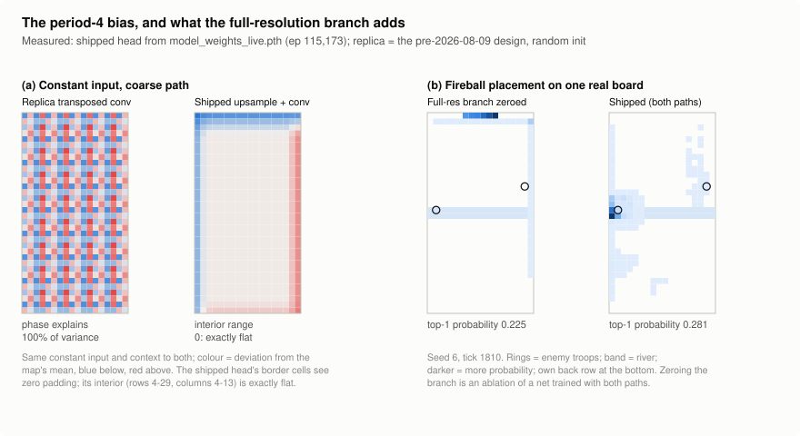
</picture>
</p>

<p align="center"><sub><b>Figure 3.3.</b> (a) Logit surface on a spatially constant input: a replica of the pre-2026-08-09 transposed-convolution head (random initialisation) against the shipped head (trained). Phase explains 100% of the replica's interior variance; the shipped head's interior is exactly flat. (b) Fireball's placement distribution from the shipped network on one board, with the full-resolution branch zeroed (an ablation) and intact. <i>Measured for this report</i> (<code>model_weights_live.pth</code>, episode 115,173).</sub></p>

### 3.5 Auxiliary heads, and why the opponent-elixir head was removed

The first auxiliary head, added 2026-07-29, regressed the opponent's
**current elixir** from `hx`. It reached a mean absolute error of **0.77**
against 1.35 for predicting the mean. That was read as evidence of opponent
modelling, because the control used, "read your own elixir", did no better
than the mean.

**It was the wrong control.** The target is an affine function of two scalars
the observation already carries:

<p align="center"><code>elixir_opp(t) = e₀ + r · t − spent_opp(t)</code></p>

Here `t` is extra scalar 0 and `spent_opp` is extra scalar 2. Ordinary least
squares on those two inputs, with four parameters and no recurrence, scores
**MAE 0.0000** (2,606 samples, 8 episodes). Each input alone scores about
1.42, no better than the mean, so the fit really does use both.

So the head's 0.77 was a *shortfall* from an achievable zero. Its loss was
arithmetic on inputs already present and put almost no pressure on memory,
which was the entire reason it existed. Meanwhile the recurrent state was
dropping the opponent's card cycle. A linear probe of the trained `hx`
decoded the next card **+0.013** better than a random projection at episode
1,522, and **−0.025** at episode 2,054.

The replacement, added 2026-08-28, predicts **which card the opponent plays
next**, over 185 ids and from `hx` only. It can't be solved from present
scalars. The benchmarks are ln 8 = 2.08 cross-entropy and 12.5% accuracy,
which is what a policy with no cycle knowledge scores against an 8-card deck.

The removal still holds under the 1× / 2× / 3× economy. Integrating the phase
schedule restores the exact fit, and the only elixir no scalar records is what
the cap discards (per-episode residual −0.035 when never capped, up to +5.38
when capped). A rising elixir error therefore detects **overflow**, and it
still isn't a test of memory.

**Table 3.9 — The next-card head's three problems.**

| Problem | Measurement | Fix |
|---|---|---|
| **Confidently wrong on unfamiliar decks** | Resuming into the 16-deck pool, CE was **13.76** against a uniform 5.22. The weighted term was 0.138 against an actor loss of ~0.020, so the shared trunk was pulled ~7× harder toward learning 60 unfamiliar cards than toward winning. | A *detached* rescale caps the term at the uniform CE. `clamp(max=)` was rejected because it zeroes the gradient exactly when the head needs to relearn. A reset tool re-initialises both aux heads (52,170 parameters, 2.75%), and verified the policy did not move. |
| **Fights the policy at a fresh start** | From random init, over 12 updates, the aux gradient on the LSTM grew from 0.62× to **1.67×** all other terms combined, and its cosine with them fell from −0.37 to **−0.84** (on the trunk: 2.01×, −0.90). | A linear warm-up over 2,000 episodes |
| **Can't protect the cycle branch** | It supplied 0.27–0.40% of the gradient on the branch, against PPO's 99.6% | The branch is detached from PPO and trained by its own card-identity head (§5.7) |

Two caveats apply. The CE cap was a real fix but **not** the cause of the
collapse it was first blamed for: two resume arms that differed only by this
fix had matching trajectories. And the warm-up is justified by a measurement
of the mechanism, not by a win-rate result. The experiment that would refute
it is written next to the constant in the code. Whether the anti-alignment
persists after the ramp is still open.

<p align="center">
<picture>
  <source media="(prefers-color-scheme: dark)" srcset="results/figures/fig-3-4-aux-loss-dark.svg">
  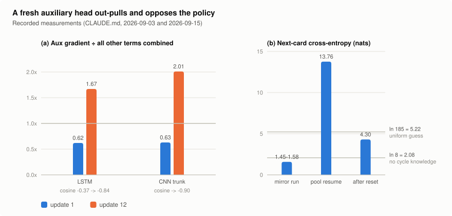
</picture>
</p>

<p align="center"><sub><b>Figure 3.4.</b> (a) The auxiliary loss's gradient on the shared LSTM and CNN trunk, relative to all other terms combined, at update 1 and update 12 from random initialisation. (b) Next-card cross-entropy on the mirror, on resuming into the deck pool, and after resetting the heads, against the uniform and no-cycle-knowledge baselines. <i>Re-plotted from recorded values.</i></sub></p>

> **Finding 3.1 — An auxiliary task is only worth its loss if it cannot be
> solved from the present input.** Before trusting an auxiliary target, fit the
> cheapest predictor with no memory (a linear regression on the current
> observation). If that predictor matches the head, the loss is shaping nothing.

### 3.6 Measured and not needed

Three standard pieces of PPO advice looked applicable, and each was refuted by
measurement. We record them because refuting one cost an hour, while
suspecting it again costs nothing.

**Table 3.10 — Suspected weaknesses that measurement refuted.**

| Suspicion | Measurement | Verdict |
|---|---|---|
| Missing orthogonal init, gain 0.01 on the policy head (Engstrom et al., 2020; Huang et al., 2022) | 10 seeds, default init: card head H/Hmax **0.9996**, placement head **1.0000**, V(s₀) = −0.009 ± 0.043 | Already near-uniform. `hx` starts at exactly zero, so every head sees a zero input and emits near-zero logits. |
| Scalars drowned by the board (64 of the LSTM's 1,504 inputs, 4.3%) | Per input dimension, ∂(card logits)/∂(input) is **2.26×** larger for scalars than for spatial cells | Width is not weight |
| Actor/critic interference on the shared trunk | Gradient cosine over 6 rollouts: trunk −0.058 ± 0.191, scalar encoder +0.103 ± 0.264, LSTM +0.016 ± 0.053. The trunk's sign **flipped** between two identical runs. | Indistinguishable from zero. Separate networks would roughly double trunk cost, which is 43% of the update, for no measured gain. |
| Zero-gradient context blocks at init are dead | They sit behind the zero-initialised `expand` convolution, which does receive gradient | Not dead |

> **Finding 3.2 — Make architectural changes additive.** The context blocks and
> the full-resolution branch both start as exact identities, so each landed
> without invalidating a checkpoint. Each could then be measured on a network
> that was otherwise bit-identical. The changes that did invalidate checkpoints
> (the checkerboard fix and the observation versions) could only be judged
> after retraining, alongside everything else that changed in that time.

---

## 4. Training Methodology

The agent is trained with **recurrent PPO** in two pipelines, run one after the
other. Phase 1 plays against a **search-based teacher** that climbs an 11-rung
competence ladder while piloting 16 real ladder decks. Phase 2 is a
**PFSP self-play league** of frozen past selves and scripted bots.
Decision-time search and expert iteration sit beside the loop as improvement
operators. Every hyperparameter below is read from the code as it ships
(`rl/config.py`, `rewards/weights.py`, `opponents/teacher.py`,
`rl/curriculum.py`), not from earlier documentation.

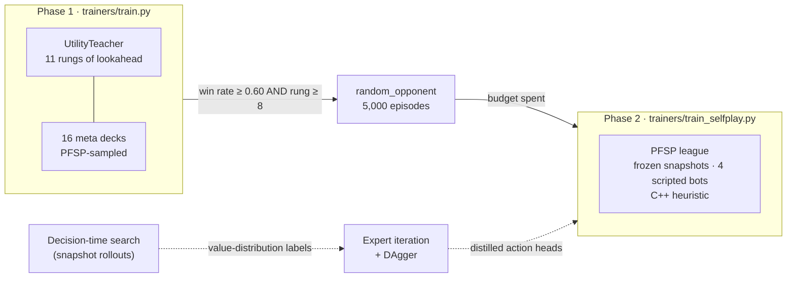

<p align="center"><sub><b>Figure 4.1.</b> The training pipeline. Solid arrows are the
automatic phase transitions. The dotted path is an offline improvement operator,
measured in §5.5 and not part of the shipped loop.</sub></p>

### 4.1 PPO configuration

**Table 4.1 — PPO hyperparameters (identical in both pipelines).**

| Parameter | Value | Why this value |
|---|---|---|
| Parallel environments | 8 | 8 workers plus the CPU-bound learner fit 12 logical cores |
| Rollout length | 500 decisions per env (4,000 transitions) | — |
| Discount γ | **0.999** | The horizon `1/(1−γ)` has to outlast a 360-decision match (§4.3) |
| GAE λ | 0.9 | At 0.95 the advantage target stayed noisy however the critic was regularised |
| Truncated BPTT chunk | **50 decisions** | One card rotation is 4 × 2.625 elixir × 28.6 ticks = **30 decisions**; the old 25 cut credit before a rotation completed |
| Epochs × minibatches | 4 × 8 | 80 segments per rollout, 10 per minibatch, 32 optimiser steps per rollout |
| Clip ε / learning rate / grad-norm | 0.2 / 3e-4 (Adam) / 0.5 | — |
| Value clip | 1.0 × return std, floored at 0.2 | A fixed 0.2 stopped the critic correcting itself on **46.1%** of samples |
| Critic weight | 0.5 | — |
| Aux next-card loss | 0.5 × 0.02, ramped in over 2,000 episodes, capped at uniform CE | §3.5 |
| Cycle-identity loss | 1.0 | Its only gradient reaches a detached branch (§3.3) |
| Placement coverage | KL 0.10 to the advisor's map, or entropy 0.02 | §4.2 |

A handful of implementation details carry most of the correctness. Each one
is listed with the defect it removed.

**Table 4.2 — Implementation details, and why each exists.**

| Detail | Defect it removed |
|---|---|
| **Truncated BPTT from stored hidden states**, instead of replaying each 500-step rollout as one sequence | 2 optimiser steps per 4,000 transitions; `ClipFrac` read **0.0000** across all 228 updates of an 18,740-episode run. Throughput went **228 → 4,224** gradient steps per hour. |
| **Actor loss and advantage normalisation over *decision* rows only.** A row is a decision when the card head had a real choice (or a Champion ability was ready). | Normalising over all valid rows left actor rows off-centre by up to 0.08 of a standard deviation, with scale errors of 5% |
| **Masks recomputed from the stored observation at update time** | A buffered mask can drift from the one the rollout used. The epoch-0 PPO ratio is logged every update and must read ~0 (measured max \|r − 1\| = 4.8e-07). |
| **A guarded optimiser step** that drops a minibatch with a non-finite gradient | One bad step turned 32 of 32 parameter tensors NaN, permanently, and the run kept training and overwrote the last good checkpoint |
| **Truncation read from `truncateds`**, not inferred from the reward | An exact-tie timeout pays ~0, so it was treated as a truncation: charged the draw penalty *and* credited a bootstrap that partly refunded it |
| **Explained variance** as the critic's health metric | The critic was declared broken three times from a flat MSE near 0.11, while explained variance measured **+0.64** |

### 4.2 Adaptive per-head entropy

The card head and the placement head share one network, one optimiser and one
batch, but they need very different amounts of exploration. A shared
coefficient could not serve both: raising it to rescue a card head at 0.4% of
maximum entropy crushed placement (top-5 cell share 36% → 70%). So each head
gets its own controller, in the style of SAC's temperature tuning:

<p align="center"><code>coef ← clamp(coef · exp(rate · (target − measured)), 0.01, ceiling)</code></p>

`measured` is the head's entropy as a **fraction of its reachable maximum**,
`log(n_legal)` per step, so that a uniform distribution over the legal arms
reads exactly 1.0 whatever the number of arms. The card target is fixed at 0.35
of maximum. Placement anneals from 0.65 to 0.25 over 60,000 episodes (0.25 of
log 612 is about five effective cells). Phase 2 starts placement at 0.50 and
adds three guards: gain 0.10, a per-update step cap of 0.10, and a ceiling of
0.20.

**The normaliser went wrong three times, and every time it produced a
behaviour** (§5.6):

| Date | Normaliser defect | Behaviour it produced |
|---|---|---|
| Jul 31 | The exploiter used raw nats where the main loop used fractions | Its placement coefficient was effectively **73×** too large; the policy dissolved to 86.7% of maximum entropy and lost 839 of 1,007 games to a bit-exact copy of itself |
| Aug 11 | Placement entropy was averaged over rows where a card was *affordable*, not *played* | The controller regulated the noise of non-actions (0.850 on no-op rows against 0.090 on real placements) and sat on its floor for 57% of updates while real placement collapsed |
| Aug 16 | Card entropy was divided by log 5 when half the decisions had only 2 legal arms | The target was 81.3% of the reachable maximum, so "play or wait" was held near a coin flip and the agent went bankrupt |

**Placement coverage.** Actor and entropy gradients reach the placement map
only for the card that was *chosen*, so a card the policy stops playing freezes
(§5.2). Each step, one affordable hand slot is sampled, weighted 5× toward
cards the advisor has an opinion on. That slot's placement map then gets
exactly one of two terms: **KL divergence to the advisor's engine-validated
score map**, where the advisor speaks, or a small **entropy bonus** where it
doesn't. Never both, because one says "be here" and the other says "spread
out". Both are regularisers outside the PPO ratio, and their coefficients are
fixed. The adaptive placement coefficient falls exactly when an unplayed card
is freezing, so it can't be used for this.

### 4.3 Reward design

The reward is a sparse **±1** on the outcome plus a dense shaping sum
(`rewards/shaping.py`). The terms fall into two groups: **potential-based**
terms `γΦ(s′) − Φ(s)`, which are policy-invariant up to a terminal residue, and
**deliberately biasing** terms. Each biasing term exists because its
policy-invariant version left some degenerate play optimal.

**Table 4.3 — The reward, as it ships.**

| Term | Weight | Form | Why it exists |
|---|---|---|---|
| Outcome | ±1 | Terminal | The objective |
| Draw (timeout, exact tie) | −1.0 | Terminal | Stalling must never pay |
| **Tower HP differential** | 0.5 | Potential: Φ = 0.5 · (dealt − taken) / 4,008 | Dense progress; towers only (§5.2) |
| **Tower destroyed / lost** | ±0.6 per tower | Event · *biasing* | Potential-based tower shaping alone left pure defence optimal: win-condition use went **7.3% → 0.7%** |
| Troop and deployed-building HP traded | 0.1 | Delta, / 4,256 | Prices a sacrificial building like a unit (break-even 1:1) |
| Opponent elixir spent | 0.03 | One-sided delta · *biasing* | At 0.15 it was worth more than winning (+0.3585 vs +0.2781 of the return) |
| Elixir overflow above 9 | −0.1 × overflow fraction | Per step | — |
| Win-condition tower damage | 1.0 × damage / 4,008 | Delta · *biasing* | Makes a connecting Hog (~0.176) worth slightly more than a lost Princess costs (0.140) |
| **Lethal-spell** | 0.15 | Potential: the deck's spell is in hand, affordable, and a tower is within its measured tower damage | Credit for cycling the spell into reach of a finishable tower |
| Spell value trade | 0.08 → 0 over 40,000 episodes | `killed / cost − casts` · *biasing, annealed* | A missed spell must cost something, or spamming it is safe |
| **Solvency** | 0.1 | Potential: 0 at or above 4 elixir, falling linearly to −0.1 at 0 | Bankruptcy |
| Flawless defence | 0.5 × fraction of own tower HP left | On a win with at least one crown · *biasing* | "Take no damage" can't be expressed in a symmetric term. Gating on a crowned win means it only ranks wins against each other. |

Four principles, each learned from a measurement:

**1. The discount has to outlast the match.** At γ = 0.99 the horizon was 100
decisions against a 360-decision match. A win was discounted to
0.99³⁶⁰ = **0.0268** at the start of an episode, while a destroyed tower paid 0.6
undiscounted, mid-episode. **One crown was worth 22.4 wins.** Over 10 greedy
episodes the terminal reward was 0.0195 of the discounted return, so ~98% of the
objective was shaping. A sacrifice play (concede HP now, win later) cost 0.5
at once and repaid 0.027 at the end, so no network could learn one.

At γ = 0.999 a win is worth 0.698. The usual objection is variance, and it was
measured and does not apply here. GAE's own lookahead `1/(1 − γλ)` barely moves
(9.17 → 9.91 steps), and the spread of the critic's targets rose by 6%. The
constant had not been wrong when it was written: the movement-speed fix
tripled match length and nobody re-derived the reward against it. A test now
pins the *relationship* (horizon ≥ match length, crown ≤ 3× a win) rather than
the number.

**2. Inaction must never be the guaranteed-zero option.** This is the single
most common failure in the reward's history. It showed up as a symmetric elixir
term (both sides banked elixir into draws), a parked Cannon whose decay was
never charged (§5.2), and timeouts scored at 0. Every fix removed a safe
nothing.

**3. Biasing terms are named, justified and annealed where possible.**
Potential-based terms keep the γ; dropping it gives a biased shaping that
looks almost identical. Φ(terminal) is not zeroed, so the tower term telescopes
to a disguised terminal bonus: over 16 seeded matches, +0.107 on wins and −0.169
on losses, aligned with both the outcome and the timeout tiebreak. It is
documented as a benign bias; zeroing it is a one-line objective change left to
the maintainer.

**4. The reward follows the deck, not a card list.** The spell terms read the
deck's own damage spell, ranked by *measured* Crown Tower damage. The
win-condition term reads a resolver ranked by measured tower damage from a
legal attack cell. A spell-less deck publishes zeros and both spell terms are
exactly zero, never NaN. The shipped 2.6 deck was checked bit-identical across
this change: 0 of 2,280 steps differed, per term and in total.

> **Finding 4.1 — If doing nothing is a guaranteed zero, the learner will find
> it.** Four separate reward defects shared one shape: a safe option with a
> certain payoff of zero beat a risky option with a positive expected payoff,
> because nothing charged the safe one. Look for the unpriced null action
> before tuning any weight.

<p align="center">
<picture>
  <source media="(prefers-color-scheme: dark)" srcset="results/figures/fig-4-2-discount-dark.svg">
  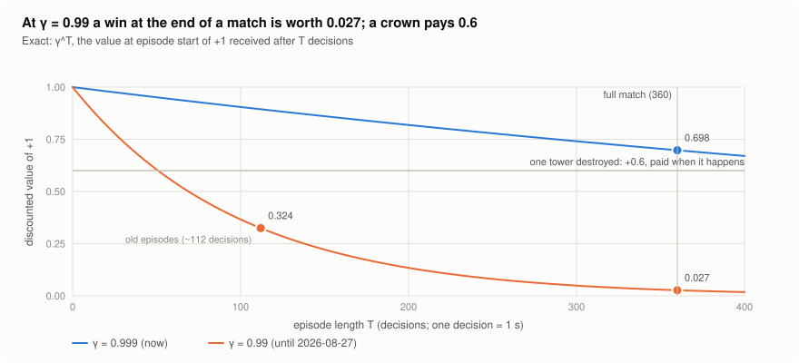
</picture>
</p>

<p align="center"><sub><b>Figure 4.2.</b> The value at episode start of +1 received after T decisions, γ<sup>T</sup>, for the old and the new discount, against the undiscounted tower-destroyed bonus. <i>Exact.</i></sub></p>

### 4.4 The search-based teacher

Phase 1's opponent is `UtilityTeacher` (`opponents/teacher.py`): **rules
propose, simulation ranks.** It is hand-written for three reasons, each
measured:

- **The neural search can't bootstrap.** It scores with the network's own
  critic, so at random initialisation it overrides 21.5% of decisions and gains
  nothing.
- **The built-in C++ heuristic is too weak.** It is beaten ~100% of the time at
  equal elixir, which leaves a zero-gradient environment.
- **An elixir handicap measurably distorts the game.** Giving the opponent
  1.5× elixir inverts which strategies pay (§5.4).

A hand-written utility has no cold start, and its difficulty can be turned by
**lookahead**, which is competence, rather than by economy.

**The decision procedure**, once per second:

1. **Propose.** Engine-validated rules (`advisors/tactics.py`) give `k` cells
   (1–3) for each card in hand, plus up to 4 two-card sequences drawn from six
   combo families.
2. **Baseline.** `snapshot()` the match and roll the *no-op* forward `H`
   ticks.
3. **Score.** Roll each candidate forward the same `H` ticks on its own
   snapshot and score it *against the baseline*, so holding scores exactly 0
   and every score is marginal:

<p align="center"><code>U(c) = w<sub>twr</sub>·Δdealt − w<sub>def</sub>·Δtaken + w<sub>trade</sub>·(Δkilled − Δlost) + w<sub>crown</sub>·Δcrowns + w<sub>pos</sub>·Δpos + w<sub>cycle</sub>·cycle(c) − w<sub>cost</sub>·cost·(1 − relief) − reserve(c)</code></p>

4. **Commit or hold.** Play the argmax only if it beats holding by the **play
   margin**. The margin is 3.0, tapering to 0 between 6 elixir and a full bar.
   It is 0 for the due second half of a committed combo.
5. **Explore.** With probability ε, play a uniformly random legal candidate
   instead. The no-op stays in that draw.

Rung 0 has no rollouts at all. It plays by a rules-only priority (answer a
threat; anti-air first against a flying building-targeter).

Two terms in `U` do work that isn't obvious:

- **`Δpos`, positional advantage, stands in for a value function.** It sums
  troop HP weighted by progress up the board, ours minus theirs. A Hog needs
  ~13 s to cross, and the horizons are 1–10 s. Scored on realised damage alone,
  the teacher never attacks and turtles. This is the problem the teacher exists
  to remove.
- **Elixir is still charged.** The no-op baseline removes what would have
  happened anyway, not the opportunity cost of the elixir actually spent. The
  charge is relieved above 9 elixir, where holding wastes income.

**Table 4.4 — Scoring profiles.** One is drawn at random each match (unless
pinned), with a lane bias, so the opponent can't be memorised.

| Profile | w_twr | w_def | w_trade | w_crown | w_pos | w_cost | w_cycle |
|---|---|---|---|---|---|---|---|
| aggressive | 0.015 | 0.007 | 0.8 | 5.0 | 25.0 | 1.0 | 0.40 |
| balanced | 0.010 | 0.010 | 1.0 | 5.0 | 20.0 | 1.0 | 0.30 |
| defensive | 0.006 | 0.016 | 1.2 | 5.0 | 15.0 | 1.0 | 0.20 |

Four mechanisms make it a sparring partner rather than a scripted bot. Each
was built against a measured failure:

**Table 4.5 — Teacher mechanisms and the evidence for each.**

| Mechanism | The failure it fixes | Measured |
|---|---|---|
| **Reactive rollouts.** The rollout opponent answers an attacking placement 10 ticks later with its cheapest body. | With both sides doing nothing in the rollout, a naked bridge push was scored against an opponent who never defends. Over 150 pushes the no-op rollout predicted **+448** tower damage over truth and said "play" **90.7%** of the time against a true 7.3% (125 false GOs, 0 false HOLDs). | Bias → +19. The rank correlation between rollout scores and true outcomes rose from −0.003 to +0.29–0.43, depending on responder design. Win rate **+0.150** (p = 1.4e-05) at 1.10× cost per decision. An open-loop answer beat closed-loop responders on cost with no significant difference in strength. |
| **The horizon gate** on reactive rollouts (H ≥ 100 ticks) | The answer is charged at +10 ticks but a Hog's payoff needs ~130, so a short rollout charges the answer and credits none of the push. Against a passive opponent, 3 of 20 openings froze at H = 30. | 0 of 20 froze at H = 100. It also switches off after 8 decisions of opponent inactivity, which had frozen the top rung against an opponent sitting on 10 elixir (30 of 116 matches → 3). |
| **Combos as sequences with a searched gap** (1, 3 or 5 s) | The engine places one card per decision, and the bar rarely holds two cards at once (p90 elixir 3.30). The teacher could propose pushes it could never afford (2 affordable states in ~2,400). | Proposals **2 → 94–109** per ~2,500 decisions. With the bar pinned so every gap is affordable, the ranking is tactical: gap 1 s +5.28, 3 s +2.53, 5 s +1.76. |
| **An economy** (`play_margin` 0.05 → 3.0) | A margin of 0.05 against a measured median of 1.37 for the plays it existed to stop: an off switch. The teacher dumped elixir continuously. | The old teacher wins **5%** of head-to-head games against the new one. The taper keeps it from freezing against a passive opponent (§5.8). |

**Table 4.6 — The competence ladder** (`TEACHER_STAGES`). Each rung moves one
axis. Rung 3 moves two, only because combos do nothing below a 2-second
horizon.

| Rung | 0 | 1 | 2 | 3 | 4 | 5 | 6 | 7 | 8 | 9 | 10 |
|---|---|---|---|---|---|---|---|---|---|---|---|
| Horizon (s) | rules | 1 | 2 | 2 | 3 | 4 | 5 | 6 | 7 | 8.5 | 10 |
| ε | 0.30 | 0.20 | 0.15 | 0.12 | 0.10 | 0.08 | 0.05 | 0.04 | 0.02 | 0.01 | 0.00 |
| Cells per card | 1 | 1 | 1 | 2 | 2 | 2 | 2 | 3 | 3 | 3 | 3 |
| Combos per decision | 0 | 0 | 0 | 2 | 2 | 3 | 3 | 3 | 4 | 4 | 4 |
| Reactive rollout | — | — | — | — | — | — | — | — | — | — | ✓ |

The ladder stops at 10 s deliberately. Past ~12 s a rollout in which only the
counter acts stops resembling the game; the neural search independently
measured horizon 20 as worse than 12. Cost ranges from 0.62 ms per decision
(rules only) to 14.1 ms at the top of the ladder, against a 1,000 ms decision
period.

**The ladder is not perfectly monotone, and we report that.** Measured rung
against rung in seat-swapped teacher matches, rung 1 scored **0.375 against
rung 0** in two independent runs (21 of 56 pooled). A 1-second rollout can't
see a push arrive, whereas rung 0's rules gate defends reflexively. Rungs 3 and
9 add nothing measurable over their predecessors (0.47 and 0.50). An agent past
rung 0 clears rung 1 quickly, so this doesn't block learning, but it is one rung
of negative difficulty and two of none.

**The teacher also has to be able to *pilot* each deck.** Its role table named
the most expensive building-targeter as the win condition. That finds nothing
in a siege, bait or Graveyard deck, and **5 of the 16 pool decks never spent a
single elixir on the card they are named for**. Against a do-nothing opponent,
X-Bow and Graveyard couldn't finish the match in 6 minutes. Win conditions are
now resolved **by injection**: each candidate card is placed at a legal attack
cell and ranked by the tower damage it actually deals. Mortar Cycle went from
4,683 tower damage over 1,769 ticks to **8,930 over 882** against the same
passive opponent. Before that fix, a deck win rate measured the teacher's
piloting as much as the deck.

> **Finding 4.2 — Difficulty should be competence, not economy.** An elixir
> handicap doesn't make the opponent better at the game. It changes which
> strategies pay, and the agent learns the handicapped game (§5.4). Lookahead
> makes the same opponent stronger without changing what is correct, so a
> curriculum built on it trains toward the real game at every rung.

### 4.5 The curriculum

Rungs are gated on the **raw** win rate over the last 100 episodes. Raw means
draws count as non-wins; a decisive-only rate would flatter a high draw rate.
There are four ways off a rung, and the level gate is the weakest of them.

**Table 4.7 — Curriculum transitions** (`rl/curriculum.py`).

| Exit | Condition | Meaning |
|---|---|---|
| **Gate** | 100-episode win rate ≥ 0.65 | Mastery: advance |
| **Plateau** | 500-episode progress unimproved by 0.02 for 1,500 episodes, and ≥ 0.40 | Converged but competitive: advance |
| Regression | Progress falls 0.04 below the rung's best after a promotion | Premature promotion: demote |
| Backstop | Below 0.40 with no improvement for 4,000 episodes | Over-promoted: demote |
| Stall | ≤ 0.10 sustained for 1,500 episodes | Catastrophe: demote |
| Floor alarm | Rung 0, ≤ 0.05 for 1,000 episodes | Nowhere to demote to: raise an alarm |

The old ladder had six rungs that moved three or four knobs at once, a 0.80
gate, and only the first and last exits in the table. It spent **23,040
consecutive episodes (~24 h) on one stage** with a win rate oscillating between
0.15 and 0.60, and zero advances. There was a gate for mastery and a valve for
catastrophe, and nothing for the band in between, which is where a curriculum
actually spends its time.

A simulation shows why 0.80 was the wrong gate. An agent of true skill 0.70
clears a single 100-episode window 1.6% of the time, but clears *some* window
within 3,000 episodes 91.6% of the time. So a level gate checked continuously is
an optional-stopping test, with an effective threshold nearer 0.70 than 0.80.
Replayed through the new manager, the old run's oscillation triggers the
plateau exit within ~2,000 episodes.

**The plateau exit is the workhorse, and PFSP makes it so.** The opponent pool
is sampled toward the agent's worst matchups, so the win rate you can read off
training is pulled toward the hard end of the pool however strong the agent
gets. Measured on the live run: the **unweighted per-deck mean rose 0.301 →
0.534**, with every deck improving, while that readable win rate stayed flat at
~0.50. The plateau and backstop therefore read a *progress signal* (the
unweighted per-deck mean), never the PFSP-weighted rate.

A saved `curriculum_stage` is an index into whichever table was live when it
was saved. When the ladder grew from 6 to 11 rungs, old stage 3 (5 s) would
have become new rung 3 (2 s). Checkpoints are therefore remapped **by horizon**
and stamped with the table size, so the remap runs exactly once.

<p align="center">
<picture>
  <source media="(prefers-color-scheme: dark)" srcset="results/figures/fig-4-3-curriculum-dark.svg">
  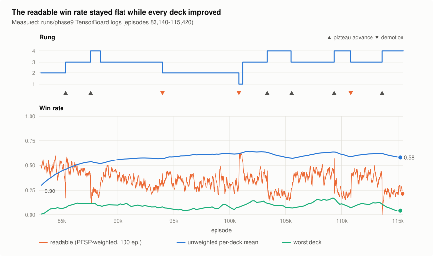
</picture>
</p>

<p align="center"><sub><b>Figure 4.3.</b> The phase-9 curriculum, episodes 83,140–115,420: the rung, with plateau advances and demotions, and three win-rate signals. The PFSP-weighted readable rate stays flat while the unweighted per-deck mean rises 0.30 → 0.58. <i>Measured</i>: <code>runs/phase9</code> TensorBoard logs.</sub></p>

### 4.6 The opponent distribution

**Phase 1** samples one of **16 RoyaleAPI ladder archetypes** each episode
(`opponents/decks/meta_decks.json`). Sampling is PFSP:

<p align="center"><code>w(deck) = max(0.05, (1 − ŵ<sub>deck</sub>)²)</code></p>

The estimate `ŵ` is count-weighted early, `α = max(0.05, 1/(n + 1))`, so it
reflects *this* policy within ~10 matches. With no deck at or above 0.05 (a
fresh network), sampling is **uniform**. The alternative would hand a losing
policy the matchup it loses hardest. The 2.6 mirror is one deck among the 16.

Three measured decisions shaped the pool:

- **Why a pool at all.** With the opponent's deck as the independent variable,
  the mirror matchup ranked **16th of 16** on the opportunity it offers Cannon,
  Fireball and The Log (§5.3). Those cards were correctly priced for a
  distribution we had chosen.
- **Filter by measurement, never by lore.** Against decks tagged as counters
  to 2.6 Hog Cycle in the real game's matchup lore, the agent's win rate
  averaged **0.589**; against untagged decks it averaged 0.433. So the tags
  point the wrong way. What beats a cycle deck in *this* engine is raw
  statline: the agent won only **0.067** against P.E.K.K.A. bridge spam, but
  0.867 against Graveyard control, a textbook counter.
- **No "unwinnable" floor.** A floor that parked decks below a 0.20 win rate
  measured the *teacher's* ability to pilot them, not their difficulty. It sent
  over half a run to two decks the teacher couldn't play. The fix for a
  hopeless matchup is a lower *rung*, not a lower deck weight: one deck scored
  0.800 at rung 2 and 0.000 at rung 10.

**Phase transitions.** Phase 1 hands off to a random-deck phase once the win
rate reaches 0.60 **and** the agent has reached rung 8, both evaluated before
any rung advance. That phase has a budget of 5,000 episodes, counted from entry,
after which phase 2 starts.

**Phase 2** is a PFSP league (`w = max(0.05, (1 − ŵ)²)`, EMA α = 0.08):

- Frozen snapshots every 2,000 episodes, eligible after 6,000, from this
  lineage only.
- Four scripted bots (Rusher, Defender, Cycler, Counter). Defender and Counter
  have a floor weight of 0.8, because PFSP's own criterion pushes the agent
  away from the matchups it has mastered.
- The C++ heuristic at 1.35× and 1.50× elixir, with floor weight 0.5.

Every opponent stays in rotation forever. PFSP replaced a linear ladder that
had two structural failures. Once the weak snapshots were exhausted, every
"next" opponent was a near-mirror, so the gate sat at 50% by construction. And
a ladder never revisits, so nothing prevents forgetting.

**Scenario injection** starts 30% of episodes already facing a win condition
at the bridge. A "defend or lose the tower" moment is rare, and its causal link
is buried deep in a long advantage trace. Truncating a scenario bootstraps the
value; it never records a terminal.

The **league exploiter** (AlphaStar's) is built and has been **disabled since
2026-08-11**. It was switched off because the agent was found reward-hacking
(parking buildings where decay was free, §5.2), and an exploiter can't punish a
strategy whose payoff comes from the reward rather than the opponent. Both
bursts it ran predate the team-1 observation fix, and so were read against an
invalid null (0.598 rather than 0.50).

### 4.7 Decision-time search and expert iteration

**Search.** At each decision, the greedy action and the policy's top
candidates (up to K = 13 with widening) are each rolled forward `H` decisions
on a snapshot. The rollout opponent is either the C++ heuristic or the
teacher's rules. All the final states are then scored in **one batched network
forward**, together with a terminal term, and search plays the argmax.
Simulation is cheap and scoring is not: one engine step costs 0.015 ms and one
scored candidate 0.13 ms, so depth is about 9× cheaper than width.

**Expert iteration** distils search back into the policy:

1. Collect play labelled by search, recording each decision's **whole ranked
   candidate set** with its values, not just the argmax.
2. Train the action heads toward `softmax(values / T)`, with the trunk, LSTM
   and critic frozen. The critic *is* the expert, so letting it drift would
   degrade future labels.
3. Pick `T` from the *target's* own entropy before looking at any outcome.
   T = 0.25 puts the target at 94% of maximum entropy, which carries no signal;
   T = 0.05 puts it near 55%.
4. Run DAgger rounds on states visited by the student.

The outcomes (+0.319 for search against the heuristic, +0.045 for
distillation, and search turning negative against the teacher) are reported as
behaviour in §5.5. The shipped agent runs its policy **greedy**, because search
is not yet better than greedy against the opponent phase 1 actually trains
against.

### 4.8 Compute and run protocol

All training runs on one **CPU-only laptop** (i5-13420H, no GPU). The measured
reference rate at rung 0 is **943 episodes and 77 PPO updates per hour**
(3.8 s per episode, 47 s per update), and it falls as the teacher's lookahead
grows. 87% of wall-clock time is the PPO update, so the engine is not the
bottleneck (§2.6). At this rate 10,000 episodes take ~10.6 h, so experiments are
budgeted in **gradient steps**, not hours. Episodes per hour are down 3× from
before the movement-speed fix, while updates per hour fell only 16%: slower
troops mean more transitions per match, not more work per transition.

A multi-day unattended run needs safeguards that a short experiment never
exercises:

- Checkpoint paths are anchored, not relative to the working directory, which
  had decided whether a run resumed or silently started fresh.
- Checkpoints are written atomically and keep a `.prev` copy, and Ctrl-C saves.
- A resume error crashes the run instead of moving the checkpoint aside.
- Every `CLASH_*` setting and the deck are stamped into the checkpoint and
  compared on resume.
- The phase-2 pool is restricted to the current lineage's snapshots.
- A pre-flight gate (`tools/validate_pipeline.py`) checks PFSP routing,
  scenario contracts, advisor targeting, the search cost ratio, the spell
  anneal, the side null and the C++ suite before a run starts.

The last pre-launch audit targeted a failure class that none of these catch: a
mechanism keyed to the old deck that goes **silent** under a new one. It found
four: the advisor target, the win-condition resolver, scenario injection and
the placement mask (§6.2).

---

## 5. Emergent Behaviours

An RL agent does exactly what its environment, objective and optimiser
jointly reward. It does no more than that and, more awkwardly, no less. This
section looks at the behaviours of the trained agent, and of its search-based
opponent, that nobody designed in. There are six case studies and each one has
the same structure: the behaviour we observed, the first explanation offered,
the measurement that tested it, and the cause that held up.

We present them this way because in five of the six the first explanation
was wrong. The behaviour turned out to be a correct response to some part of
the system other than the game itself.

The claim that ties the cases together, made precise in §5.9, is that at least
five layers can **author** an observed behaviour:

| Layer | Example in this section |
|---|---|
| the engine's physics | a missing one-second deploy time (§5.4) |
| the reward | a building priced like a Crown Tower (§5.2) |
| the network architecture | a transposed convolution's period-4 bias (§5.2) |
| the optimiser and its regularisers | an entropy normaliser with an unreachable maximum (§5.6) |
| the agent's world model (for search) | a rollout opponent that does not resemble the real one (§5.5) |

A behaviour tells us what the agent learned about Clash Royale only after the
first four have been ruled out.

### 5.1 Measuring behaviour

Training curves (win rate, reward, entropy) were blind to **every** behaviour
in this section. Each was found and resolved with a conditional statistic or an
engine-scored counterfactual. Table 5.1 lists the instruments.

**Table 5.1 — Behavioural instruments.**

| Instrument | Question it answers | Why the aggregate is not enough |
|---|---|---|
| Engine-scored counterfactual (`eval/prove_*.py`) | Is this decision better than a random legal cell, the advisor or the oracle? | A win rate integrates thousands of decisions. This scores one decision against paired alternatives from the same snapshot. |
| Modal share **and** top-1 probability, per card | Does a card's placement depend on the board? | Entropy can't see a per-card collapse: a mixture of sharp modes still has high entropy. Modal share alone degenerates on a flat map. |
| `P(play \| in hand)`, `P(play \| affordable, threat)` | Is a card avoided, undervalued or unaffordable? | Marginal usage confounds valuation with affordability. |
| Observation ablation (total-variation distance) | Does the policy actually read this part of the input? | Presence in the input is not dependence on it. |
| Linear probes on hidden state | Does a representation keep an input's information? | Information present in the observation isn't necessarily used. |
| Phase histogram (`x mod 4`) plus a constant-input test | Is a spatial preference an architectural artefact? | A trained policy concentrates on columns for tactical reasons too. |

**The counterfactual protocol.** Most of the numbers below come from the
first row, so it gets a paragraph. `env.snapshot()` (§2.5) forks the live
match. The candidate decision is applied to the fork, the engine runs for a
fixed horizon, and we read an engine statistic: tower HP preserved, elixir
value killed, or tower damage dealt. Every arm starts from the same snapshot,
so every comparison is paired.

There are three reference arms:

- a **random legal cell**, which sets the chance floor;
- the **advisor** (`advisors/tactics.py`), a hand-written, engine-validated
  placement rule;
- where it is affordable, an **oracle**: the best of all legal cells, found by
  exhaustive rollout.

Two cautions came out of this protocol. First, `inject()` places a unit **without
charging its elixir**. A Cannon scored by injection was worth +841 tower HP
under attack. Scored through `env.step`, which charges the cost, it was worth
**+185** (better in 6 of 14 states). Second, a harness needs a control that
**must** stay constant. Our seeded greedy arm read 0.750 in one run and 0.875 in
another on identical seeds, and that exposed an unseeded opponent RNG that had
already produced two wrong conclusions.

---

### 5.2 Case I — The Cannon behind the King

<sub>**Regime:** Giant beatdown deck · engine v1.0 – v1.2 (Aug 6–15, 2026) · checkpoints ep ≈ 45k – 130k</sub>

**Observed.** A Cannon earns its elixir by pulling and killing attackers near
the bridge, around y ≈ 13–15. The agent put its Cannons deep in its own half.
On the ep-130,306 checkpoint, **27.9%** of Cannons landed on the two cells
beside its own King Tower, `(11,2)` and `(11,3)`. The mean placement row was
**y = 6.3**, about nine rows short of the river.

It took **three independent causes**, found and fixed one after another over
nine days, to remove this behaviour. Each one alone was enough to produce it,
and none showed in any training curve.

**Table 5.2 — Three stacked causes of one behaviour.**

| Found | Hypothesis | Decisive measurement | Verdict | Resolution |
|---|---|---|---|---|
| Aug 6 | **Reward:** the agent's own buildings were priced like Crown Towers, and building decay cost nothing | Losing the Cannon's 824 HP cost 0.103 reward. Killing with it paid 0.1 · hp / 4256, so it had to kill **5.3×** its own HP to break even. Decay emits no damage event, so parking the Cannon cost exactly **zero**. | Real, but incomplete | Tower potential reads Crown Towers only |
| Aug 9 | **Architecture:** a checkerboard bias from `ConvTranspose2d` | The concentration is **card-independent**: Giant 44.4%, Valkyrie 38.9%, Musketeer 35.1%, Cannon 27.1% (803 placements). On a spatially constant input, phase explains **100%** of the logit surface. | Real, and the dominant cause | Nearest-neighbour upsample + stride-1 conv |
| Aug 11–15 | **Optimiser:** a gradient-coverage deadlock | All 123 Cannons (100%) landed at y = 0, and 93.5% never had an enemy in range. The policy's cell preserved **121 HP**, against **396 HP for a random legal cell** (paired −274, 95% CI [−328, −221], 449 threatened states). | Real: placement worse than chance | Advisor-targeted coverage term + full-resolution branch |

**Cause 1: the price of a building.** The tower potential read the engine's
building-damage total, which counts Crown Towers **and** deployed buildings. So
a sacrificial card was charged at the Princess Tower rate. The cheapest outcome
was a Cannon nothing ever reached, because decay is not damage and never
charged anything.

The fix separated towers from buildings. A controlled caution came with it:
forcing the Cannon to a fixed "better" cell did not improve win rate (centre
0.605 against the learned policy's 0.610, 200 episodes each). Forcing it into
the corner was worst, at 0.515. So the corner really was bad, but no fixed
alternative beat the learned state-dependent mix. *A forced-placement A/B
answers "is this cell better?", not "what would a policy learn under a
corrected reward?"*

**Cause 2: a period-4 bias in the head.** The card and state context enter the
placement head as a **spatially uniform** vector. A `ConvTranspose2d(k=2, s=2)`
applies a different weight at each of the four positions in its output block,
so a uniform input does not produce a uniform output. Two such layers stacked
imprint a fixed `(x mod 4, y mod 4)` pattern that is the same for every card
and every state. The card can only shift the map by a constant. It can never
change which cell inside the period wins.

This is the checkerboard artefact of Odena et al. (2016). Here it appears in a
policy head rather than in an image generator.

| Metric | Broken head | After the fix |
|---|---|---|
| Logit variance explained by phase (constant input) | 100% | 0% (interior range 0.000000) |
| Placements on `x ≡ 3 (mod 4)`, null 22.2% | **73.0%** (χ² = 94.8, 3 df) | — |
| Placements on `(11,2)` / `(11,3)` | 28.9% | **0.9%** |
| Distinct cells used (of 288 legal) | 91 | **208** |
| Head fwd + bwd time, batch 256 | 246 ms | 136 ms |

What localised this cause was the cards that had **no reason** to be affected.
No argument about building prices makes a *Giant* walk behind its own King 44%
of the time.

One caveat carries forward. A healthy trained policy also concentrates on
certain columns: the shipped net measured 43.6% on `x ≡ 1 (mod 4)`, χ² = 96.3.
So the histogram alone false-alarms. The constant-input test tells the two
apart: phase explains 6.8–14.0% of the trained head's surface, against 100% for
the broken one.

**Cause 3: a card that stops being played stops being trained.** Both the
actor loss and the placement entropy bonus flow through the placement head
**only for the card that was chosen**. A card the policy stops playing gets
exactly zero placement gradient, and a unit test asserts `== 0.0`. The loop
feeds itself:

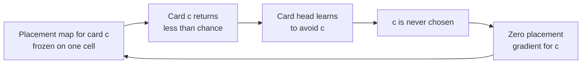

The trigger was itself a correct fix. On August 11 the entropy term was changed
to count real placements only. Until then the entropy controller had been
regulating the noise of **non-actions**: it reported 0.462 of maximum, which
was 0.850 on no-op rows and **0.090** on real placements. But the no-op rows
that stopped being rewarded had been the only thing keeping unplayed cards'
maps spread out. Cannon and Giant went from the **highest** per-card placement
entropies to the **lowest**.

Entropy alone doesn't break the loop. A coverage term (placement entropy on
one sampled affordable slot per step) flattened the map to a top-1 probability
of 0.051, against a uniform 0.0016. The greedy argmax simply moved from
`(11,0)` to `(6,0)`, because **the argmax of a flat map is an arbitrary
constant**. Entropy says "spread out"; it never says "depend on the board".

What broke the loop was a **target**. Where the advisor has an opinion, the row
is trained with KL divergence toward the advisor's engine-validated score map.
A zero-initialised full-resolution residual branch (§3.4) let the head express
that target at one-tile resolution.

**Table 5.3 — Cannon placement, engine-scored.** Tower HP preserved over the
Cannon's 300-tick lifetime, n = 1,582 paired states, reference policy fixed.

| Policy | HP preserved | Δ vs random cell | Modal cell | Modal share | Top-1 p |
|---|---|---|---|---|---|
| Seed (full-resolution branch, distilled) | 276.0 | −135.3 | `(11,0)` | 44.9% | 0.140 |
| + coverage entropy only (80 updates) | 403.0 | −8.3 | `(11,0)` | 27.1% | 0.050 |
| **+ advisor target (524 updates)** | **553.1** | **+141.8** [+74.5, +210.2], p = 0.0071 | `(16,15)` | **17.0%** | 0.062 |
| Random legal cell | 411.3 | — | — | — | — |
| Advisor (ceiling) | 687.9 | +276.6 | — | — | — |

Read the last three columns together. Modal share falls while top-1 probability
stays well above uniform. That describes a head that is **sharp and moves its
mode with the board**, as opposed to one that has dissolved toward uniform. The
cured modal cell `(16,15)` is the right bridge mouth on the agent's own side,
where a Cannon belongs.

<p align="center">
<picture>
  <source media="(prefers-color-scheme: dark)" srcset="results/figures/fig-5-1-cannon-dark.svg">
  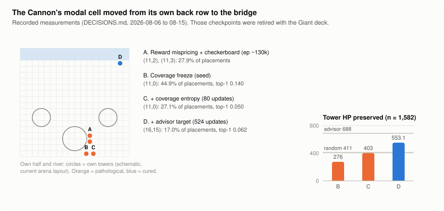
</picture>
</p>

<p align="center"><sub><b>Figure 5.1.</b> (Left) The Cannon's modal cell at four stages, on a schematic of the agent's half. (Right) Tower HP preserved over the Cannon's lifetime, engine-scored on 1,582 paired states, against a random legal cell and the advisor. <i>Re-plotted from recorded values; those checkpoints were retired with the Giant deck.</i></sub></p>

> **Finding 5.1 — One behaviour, three authors.** The reward, the architecture
> and the optimiser could each produce a back-row Cannon on their own. All three
> were hidden from `Entropy/Placement_Measured`, which tracked its target the
> whole time. The first explanation was real. Had the investigation stopped at
> the first fix, it would have been reported as the whole story.

---

### 5.3 Case II — Declining the Fireball: abstention as correct valuation

<sub>**Regime:** several — each measurement is tagged individually below</sub>

**Observed.** In nearly every lineage the agent almost never cast Fireball.
At ep 32,484 of the 2.6 Hog Cycle lineage, `P(play | in hand)` was **0.0011**,
against 0.34 for Skeletons. The obvious reading was a learning failure: a
strong card the policy never found.

**First test: force it.** On an early engine version (July 2026), forcing
Fireball usage dropped win rate from **97% to 23%** (95% CIs [83, 99] and
[12, 41]). That result set a standing rule for the project: measure before
"fixing" a gap in behaviour. We then found three layers of reasons why
declining Fireball was right.

**Layer 1: the board rarely offered a target.** We computed an upper bound on
Fireball's catch: perfect information, and the best of all 612 blast centres.
On the 2.6 deck under the flat economy, the **median best-case catch was one
unit**. Only 15.5% of states offered three or more. A 4-elixir spell whose best
possible cast usually catches one unit has negative expected value.

The real 1× / 2× / 3× elixir schedule (§2.2) fattened the tail but left the
median where it was:

| Same policy, same stage, 24 episodes | Flat 1× | 1× / 2× / 3× |
|---|---|---|
| Enemy units on board (mean) | 3.62 | 3.89 |
| Best-case catch, **median** | **1** | **1** |
| P(catch ≥ 3) | 15.5% | 21.8% |
| P(catch ≥ 4) | 6.1% | 10.4% |

**Layer 2: the placement head was broken at the same time** (Giant-deck era,
Aug 14). Its cells returned **0.022** elixir of value per cast, against 1.103
for a random legal cell over 1,059 states, which is **50× worse than chance**.
Paired with that placement function, a low card-head probability was the
correct response. *The card head was correctly pricing a broken placement
head.*

After the fix from Case I was applied to Fireball, the net's placement reached
**2.565** elixir, against the advisor's 2.464 and random's 0.469. That made
Fireball the first card on which the net matched its hand-written teacher. Its
modal share fell from 32.8% to 12.7% while its top-1 probability *rose* from
0.087 to 0.112. The head became more confident within a state and less
repetitive across states, which is the healthy signature defined in §5.1.

**Layer 3: the opponent distribution we chose** (2.6 lineage, Sep 3). In the
2.6 mirror, the opponent's deck is mostly single-body cards. We made the
opponent's deck the independent variable: 16 RoyaleAPI ladder decks × 30
episodes, about 82,000 decisions, ep-32,484 policy. The mirror ranked **16th
of 16** on every opportunity metric:

**Table 5.4 — Opportunity offered per decision, by opponent deck.**

| Best case per decision | Mirror | Pool median | Median / mirror | Richest deck |
|---|---|---|---|---|
| Fireball catch (enemy HP) | **323** | 494 | 1.53× | `royal_hogs_furnace` 884 (2.7×) |
| Threat HP on own half (what a Cannon answers) | **270** | 503 | 1.86× | `mega_knight_ram` 858 (3.2×) |
| Enemy units on board | **1.0** | ~2.0 | ~2× | — |

<sub>The Log's opportunity row is omitted. It was computed with a damage cap
later found to be 11% low (240 vs 269), see DECISIONS.md, `measure_deck_matchups`.</sub>

So the card was never underpriced. It was **correctly priced for a
distribution we had chosen**.

When the deck pool was introduced, 490 episodes of training doubled Fireball's
marginal usage (0.0080 → 0.0159, 3.6× the checkpoint-to-checkpoint jitter). The
discrimination ratio did not move beyond noise, and usage also rose *on boards
offering no target*. On that timescale the environment moved how much Fireball
was used, not the conditions under which it was used.

**A related counterintuitive result: aiming at where a target will be makes
Fireball worse.** Fireball lands 10 ticks after it is cast, so aiming ahead of
a moving target looks obviously right. Measured over 1,059 paired states,
aiming at the current position (lead 0) captures **75.5%** of achievable value;
leading by 10 ticks captures **52.4%**. The blast radius (2.5 tiles) is larger
than one second of movement (0.6–1.6 tiles), so a moving target stays inside it
anyway. Meanwhile a target that is standing still, which is the common case for
a unit already fighting, gets led straight out of the blast.

<p align="center">
<picture>
  <source media="(prefers-color-scheme: dark)" srcset="results/figures/fig-5-2-deck-opportunity-dark.svg">
  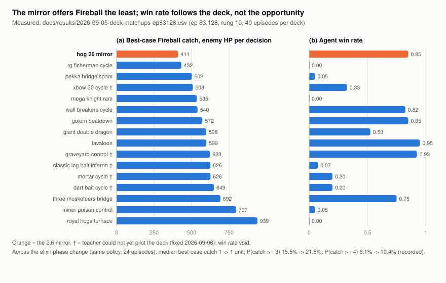
</picture>
</p>

<p align="center"><sub><b>Figure 5.2.</b> Best-case Fireball catch per decision and the agent's win rate, by opponent deck. <i>Measured sweep in the repository</i> (<code>docs/results/2026-09-05-deck-matchups-ep83128.csv</code>, episode 83,128, rung 10). It is a later sweep than the one behind Table 5.4, and it also ranks the mirror last. Rows marked † predate the teacher-piloting fix and are void.</sub></p>

> **Finding 5.2 — Abstention as valuation.** Declining Fireball was the
> correct response three times over: to the board, to the agent's own placement
> head, and to an opponent distribution we had chosen. A claim that a card is
> "dead" should start with an engine-scored counterfactual of that card at its
> *best* cell, not with a usage statistic.

---

### 5.4 Case III — The defensive equilibrium and the missing punish window

<sub>**Regime:** v0.x – v1.3 · Giant and 2.6 decks · resolved by an engine change on 2026-08-19</sub>

**Observed.** Across reward designs, decks and opponents, the agent repeatedly
settled into a defensive posture: cheap cycle cards, efficient trades and
almost no win-condition play. In the 2.6 lineage the Hog Rider made up
**0.8%** of the agent's plays. The simulation-ranked teacher, playing the same
deck, used it for **16.5%** of its plays.

**The reward came first.** Each reward design in Table 5.5 produced its own
version of the same equilibrium.

**Table 5.5 — Reward designs and the passivity each produced.**

| Reward design | Emergent behaviour | Measurement |
|---|---|---|
| Symmetric elixir-trade term (it charged the agent's own spending too) | Both sides banked elixir into draws | Doing nothing was a guaranteed-zero outcome |
| One-sided elixir trade, weight 0.15 | Pure efficient defence | The term was worth **+0.3585** of the discounted return, against **+0.2781** for winning (12 games). The greedy policy never played its win condition in 47,000 episodes, and beat an attacking scripted bot 13–0–2 without one. |
| Policy-invariant (PBRS) tower shaping | Win-condition usage decayed | 7.3% → **0.7%** over 8,300 episodes |
| γ = 0.99 over 360-decision matches | Sacrifice plays could not be represented | A win was discounted to 0.0268. One crown was worth **22.4 wins**, and ~98% of the objective was shaping. |

The responses (§4.3) were: cutting the elixir-trade weight to 0.03, a
tower-destroyed bonus that is deliberately *not* policy-invariant, a draw
penalty, and γ = 0.999.

**Then the environment.** Four interventions on the policy side all returned
null or negative results:

**Table 5.6 — Four attempts to make the agent attack (2.6 deck, vs the heuristic at 1.5× elixir).**

| Intervention | Result |
|---|---|
| Win-condition damage reward multiplier | Fired thousands of times; usage did not move |
| Hog advisor (engine-validated bridge cell, +176 tower damage) | Usage went 0.4% → 0.2% |
| Forced usage, ε = 0.15 | Win rate **−0.125**, p = 0.044 |
| "Smart" forcing (advisor timing gate + advisor cell) | Win rate **−0.300**, p = 3.2e-06 |

The dose-response is monotone: more usage, less winning. That is the signature
of a policy **correctly valuing a negative-EV action**, not of one failing to
find a positive-EV action.

**Removing the network.** To separate "the environment prices this badly" from
"this network can't execute it", we ran the test with no network at all: both
sides were the deterministic teacher, 100 paired matches at equal elixir.
Sending the Hog to the bridge (`attack`) won **0.510**. Spending the same card
harmlessly in its own half (`cycle`) won **0.840**, a difference of −0.330
(p = 5.7e-08). Never playing the Hog at all (`ban`) won **0.910**.

Two further checks ruled out the card and the mechanic. A lone Hog on an empty
board deals 2,536 tower damage, a full Princess Tower, so the card works. When
the defender's elixir was forced to 1.0, the Hog gained **+391 HP (+62%)**, so
the punish mechanic is real.

**The gate sweep located the problem.** We measured the marginal value of one
commitment, gated on the opponent's elixir:

**Table 5.7 — Marginal tower-HP value of committing the Hog, by timing gate.**

| Commit while opponent elixir ≤ | States | Tower-HP Δ | 95% CI | Sign test p |
|---|---|---|---|---|
| 7.0 (shipping) | 220 | −298.2 | [−494, −107] | 0.22 |
| 3.0 | 160 | −268.6 | [−455, −90] | 0.0085 |
| **1.5** | 162 | **−585.4** | [−816, −360] | **9.2e-06** |

**Tighter timing is worse.** An opponent whose elixir is naturally low is low
*because it just spent*. Its push is already on the board, and the right move
is to defend. The punish window exists in principle, and it essentially never
occurs in the engine's dynamics.

**The engine was missing a second.** Units in the real game take about one
second to deploy. The engine let them act on the tick they were placed. That
gap is **not symmetric**. A defender places into a threat that is already
there and needs its answer to act at once. An attacker places before contact
and would have spent that second walking anyway. So every defensive placement
received a subsidy: the defence answered a 4-elixir Hog for **1.07 elixir**.

We ran a controlled experiment: the same harness and the same supported push
(tank first, win condition behind it), with the engine rebuilt at each setting.

**Table 5.8 — Marginal value of a supported push, engine as the only variable (~161 states per arm).**

| Engine | Tower-HP Δ | 95% CI | Sign test |
|---|---|---|---|
| No deploy time | −73.7 | [−349.5, +195.3] | 70 / 78, p = 0.57 |
| **1 s deploy time** | **+448.5** | [+137.3, +760.1] | 88 / 64, p = 0.062 |

With deploy time, the elixir the defence needed to answer a lone Hog rose from
1.07 to **2.93**. A *lone* Hog got worse: its punish-window damage fell from
1,025 to 343, because it now stands inert under tower fire for a second. The
*escorted* push held at 993.8. Escorting became worth **+650 HP** [+429, +878].
You don't send a naked win condition, and now the engine prices that.

<p align="center">
<picture>
  <source media="(prefers-color-scheme: dark)" srcset="results/figures/fig-5-3-marginal-value-dark.svg">
  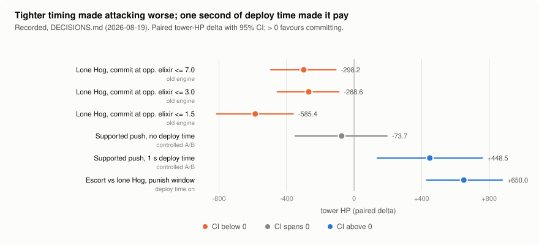
</picture>
</p>

<p align="center"><sub><b>Figure 5.3.</b> Paired marginal tower-HP value of committing the win condition, with 95% CIs: the gate sweep on the old engine, the deploy-time A/B, and the value of an escort. <i>Re-plotted from recorded values.</i></sub></p>

**Postscript.** After deploy time, the strategy-level arm still favoured
cycling (0.490 vs 0.715). By then the reason was the teacher: it could only
send lone Hogs, which led to the multi-card teacher (§4.4). The agent's own
Hog *placement* had been healthy throughout: +28.5 tower damage over a random
cell, across 155 distinct cells. Its low usage was a *valuation*, not a broken
placement.

> **Finding 5.3 — The agent had solved the environment we built.** Four
> mechanisms that tried to make it attack changed the policy but not the
> payoff. The fix was a missing second in the engine. When interventions on
> the policy show a monotone dose-response (more usage, less winning), stop
> intervening on the policy and audit the payoff.

---

### 5.5 Case IV — Lookahead decision shifts: search learns to wait

<sub>**Regime:** Giant deck, ep ≈ 64k – 78k, vs the C++ heuristic at 1.5× elixir (Aug 11–16) · re-measured vs the teacher, 2.6 deck + 16-deck pool, ep ≈ 111k (Sep 6)</sub>

Decision-time search (§4.7) takes the policy's top-K candidates, with the
greedy action always included as candidate 0. It rolls each one forward on a
snapshot, scores the result with the network's own critic, and plays the
argmax.

**Observed.** Search raised win rate from **0.625 to 0.944** (+0.319, 95% CI
[+0.237, +0.401], p = 5.6e-12, 160 paired trials; 56 better / 5 worse / 99
tied). Yet it overrode the greedy action on only **13.8%** of decisions (5,764
of 41,792).

The overrides were dominated by one kind of choice. Of 2,126 card-level
deviations, **1,847** were search *declining to play* where greedy would have
played, and only 137 were the reverse. That is a ratio of **13 : 1**. Mostly,
search waits.

The scorer is the same network's critic, so the gap is internal: the value
head exploits the network's knowledge better than the action head does. That
is the precondition for distillation.

**Distilling a conditional.** We measure distillation with the **conditional
lift**, restricted to rows where the original policy plays:

- `p1 = P(student waits | expert waited)`
- `p0 = P(student waits | expert played)`

A student that drifts toward waiting everywhere raises both; one that learned
the rule separates them.

**Table 5.9 — What the student learned, by target type (held out, frozen trunk unless noted).**

| Target | Conditional lift | p1 / p0 | No-op rate (null 0.826) |
|---|---|---|---|
| Hard label (argmax) | +0.046 ± 0.068 | 1.19 | 0.872 |
| Hard label, full network, 8× reweighting | −0.010 ± 0.060 | 0.99 | **0.967** |
| **Value distribution, T = 0.05** | **+0.103 ± 0.041** | **3.07** | **0.822** |
| Value distribution, full network | +0.142 ± 0.051 | 2.42 | 0.835 |

Hard labels teach the *marginal*: wait more. The reweighted arm waited on 97%
of rows regardless of the expert. The value distribution keeps the *margin*,
so "waiting is slightly better" and "this play is a blunder" stay distinct. The
student then waits **differently at an unchanged budget**: a no-op rate of
0.822 against the null's 0.826. With DAgger, the lift reached +0.173.

It converted to **+0.045 win rate** (95% CI [+0.013, +0.077], p = 0.0074,
n = 1,600), about 14% of what search itself buys.

**Horizon.** Against the heuristic, the gain peaks at 12 seconds (Table 5.10,
left). Beyond that, a rollout in which our own side stands still stops
resembling the game.

**The behaviour reversed when the opponent changed.** On August 19 the
phase-1 opponent became the UtilityTeacher, which simulates forward itself. We
re-measured search against it: ep-111k policy, rung 3, 16-deck pool, seeded.
The greedy control read **0.844 in every arm**, which is what makes the
pairing trustworthy.

**Table 5.10 — Search vs greedy, by horizon and opponent.**

| Horizon | vs heuristic @1.5×: greedy → search | vs teacher (rung 3): greedy → search | Δ vs teacher [95% CI] |
|---|---|---|---|
| 4 | 0.483 → 0.667 | 0.844 → 0.531 | −0.313 [−0.531, −0.125] |
| 8 | 0.525 → 0.925 | 0.844 → 0.312 | −0.531 [−0.719, −0.313] |
| 12 | 0.563 → **0.963** | 0.844 → 0.375 | −0.469 [−0.688, −0.250] |
| 20 | 0.488 → 0.875 | — | — |

Against the teacher, search deviates on 23–27% of decisions, so this is not a
vacuous null: it chooses differently, and worse. The rollouts had been stepping
the **C++ heuristic** as the opponent. That is a passable model of the
heuristic and a poor model of a forward-simulating teacher.

In a follow-up harness we gave the rollouts the teacher's own rules as the
opponent model. That was worth about **+0.12** at both horizons: −0.167 →
−0.067 at h4, and −0.469 → −0.333 at h12. It was not
enough to make search positive. The remaining hypothesis is that our own side
does nothing throughout the rollout, which is mildly pessimistic over 4 s and
grossly so over 12. The deployable agent runs its policy greedy.

The same logic applied one level up. When *both* sides were given search, the
cured net's head-to-head advantage over its predecessor disappeared (0.4425,
[0.3825, 0.5025]). The +0.72 headline had come from search, not from the
weights.

<p align="center">
<picture>
  <source media="(prefers-color-scheme: dark)" srcset="results/figures/fig-5-4-search-horizon-dark.svg">
  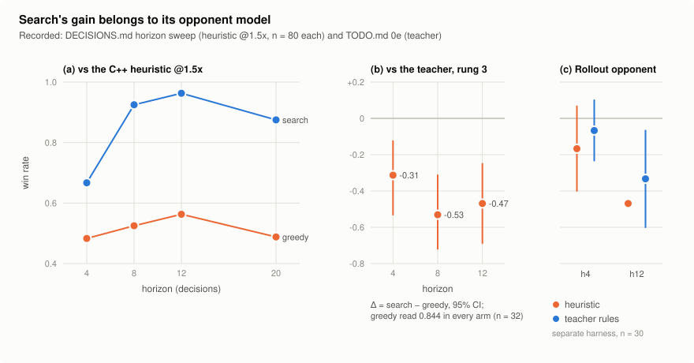
</picture>
</p>

<p align="center"><sub><b>Figure 5.4.</b> (a) Search and greedy win rates against the C++ heuristic, by horizon. (b) Search − greedy against the teacher, with 95% CIs. (c) The rollout's opponent model, in a separate harness. <i>Re-plotted from recorded values.</i></sub></p>

> **Finding 5.4 — A lookahead agent's behaviour belongs to its world model.**
> Search's tendency to wait was not a principle of Clash Royale that it had
> discovered. It followed from how the rollouts modelled the opponent. Waiting
> was right against an opponent the rollout modelled well, and harmful against
> one it modelled badly. A result from search should always be reported
> together with the opponent model its rollouts assumed.

---

### 5.6 Case V — "Apathy" that was bankruptcy

<sub>**Regime:** Giant deck, cured net (Aug 16) · follow-up on the 2.6 lineage at ep 600</sub>

A live session against the real game reported three symptoms: suicide
placements (a Musketeer dropped onto a Mini P.E.K.K.A.), disconnection from the
board, and defensive apathy. We tested each one in the simulator before
changing anything.

**Table 5.11 — Three reported symptoms, tested.**

| Symptom | Test | Result | Verdict |
|---|---|---|---|
| Suicide placements | Musketeer, engine-scored against a random legal cell, 337 paired states | 5.745 vs 4.481 elixir killed (+1.264, [+0.650, +1.872]), and 297 HP less tower damage taken | **Refuted** |
| Disconnected from the board | Every enemy troop deleted from the observation, then the policy re-queried from the same hidden state (1,532 states) | Placement distribution moves by TV **0.444**, and the argmax changes in **60.4%** of states (switching the card moves it by TV 0.625) | **Refuted** |
| Defensive apathy | `P(play)` across threat buckets | Flat, 0.1008 → 0.1016. But `P(play \| affordable)` rises 0.3655 → 0.4719, and nothing is affordable on **73.9%** of steps (78.5% under the largest threats) | **Confirmed, as bankruptcy** |

The agent was neither blind nor apathetic. It was **broke**, and the cause was
the optimiser. The card head's entropy was divided by `log 5` (four slots plus
the no-op) and driven toward a target of 0.35. But the affordability mask
leaves only `(#affordable + 1)` legal arms, and on 54.1% of decisions that is
just two: one card and the no-op.

| Legal arms on a decision step | Share | Reachable maximum |
|---|---|---|
| **2** | **54.1%** | log 2 = 0.693 |
| 3 | 15.6% | 1.099 |
| 4 | 25.8% | 1.386 |
| 5 | 4.5% | 1.609 |

The target, 0.35 · log 5 = 0.563 nats, is **81.3%** of the reachable maximum
in the majority case. So the controller demanded that "play or wait" stay close
to a coin flip. A policy flipping a literal coin scored 0.413 on the old scale
and looked about right. The measured value, 0.3125, looked *too low*, so the
controller kept **raising** the coefficient. The agent was being paid to spend
elixir as soon as it arrived, and could not afford to defend.

**The fix** normalises each head per step by `log(n_legal)`. A test pins the
invariant: a uniform distribution over the legal arms reads exactly 1.0 at any
number of arms.

| 2.6 lineage, ep 600, after the fix | Before (Giant deck) | After |
|---|---|---|
| P(nothing affordable) | 73.9% | **52.9%** |
| `P(play \| affordable)`, no threat → largest threat | 0.3655 → 0.4719 | **0.4606 → 0.8601** |

**The limit, stated plainly.** The deck changed in the same release, and 2.6
Hog Cycle has two 1-cost cards. Attributing the gain cleanly would need a
from-scratch arm on the old normaliser (about 28 hours), and we did not run it.
The mechanism itself is not confounded: it is arithmetic.

<p align="center">
<picture>
  <source media="(prefers-color-scheme: dark)" srcset="results/figures/fig-5-5-bankruptcy-dark.svg">
  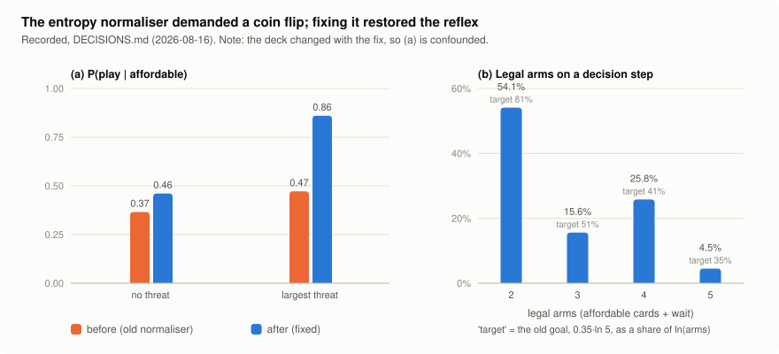
</picture>
</p>

<p align="center"><sub><b>Figure 5.5.</b> (a) P(play | affordable) with no threat and under the largest threat, before and after the normaliser fix (confounded with a deck change). (b) How many arms are legal on a decision step, and the old entropy target as a share of each case's reachable maximum. <i>Re-plotted from recorded values.</i></sub></p>

> **Finding 5.5 — A regulariser can author behaviour.** The "apathy" was an
> optimiser artefact that showed up through the economy. The two refuted
> symptoms are as informative as the confirmed one, because together they
> cleared both the architecture and the observation.

---

### 5.7 Case VI — The cycle branch becomes a tempo meter

<sub>**Regime:** 2.6 deck · v2.0 – v2.1 · `model_weights_phase4.pth`, ep ≈ 7,200</sub>

Observation v4 exposed the opponent's card cycle as a `seen[]` block and a
`recency[]` block over all 185 card ids. They pass through a 24-dimensional
branch of the scalar encoder (§3.3). The information is present. **Is it
used?**

We fitted linear probes for the opponent's *next* card and report lift over
the marginal (24 episodes, 5,366 decisions):

**Table 5.12 — Where next-card information survives.**

| Representation | Next-card lift |
|---|---|
| Observation's cycle block (ceiling) | **+0.412** |
| Cycle branch at initialisation | +0.195 |
| Cycle branch after PPO | +0.169 |
| LSTM state at initialisation | +0.135 |
| LSTM state after PPO | **+0.046** |
| Everything except the cycle block | +0.031 |

Training made the representation *worse* at the task than random
initialisation. PPO supplied 99.6% of the gradient on the branch and spent it
extracting an aggregate: how active the opponent had been, a one-dimensional
**tempo** readout. The eight deck columns of the shared card projection
collapsed toward a single direction:

| Geometry of the eight deck columns | At init | After PPO |
|---|---|---|
| Mean pairwise \|cos\| | 0.191 ± 0.017 | **0.461** |
| Effective rank | 7.48 | 6.01 |
| Variance on PC1 | 32% | 54% |

Capacity was not the problem. An 8-unit layer trained for the task keeps 92%
of the ceiling. Given a gradient for card identity, the collapsed weights
recover to +0.390 and \|cos\| returns to 0.202. An auxiliary next-card loss
was present, but it supplied only 0.27–0.40% of the gradient on the branch.
The actor, critic and entropy terms together outweighed it about 250×, and
matching them would have taken a coefficient large enough to dominate the
whole loss. So the branch was instead detached from PPO's gradient and given
its own card-identity objective.

> **Finding 5.6 — Information in the observation is not information in the
> policy.** The optimiser found the cheapest useful statistic in the cycle
> block, tempo, and discarded card identity. For a representation to keep a
> piece of information, some gradient has to ask for it.

---

### 5.8 The opponent's behaviour

<sub>**Regime:** the UtilityTeacher, v1.3 – v3.0</sub>

The search-based teacher is not learned, but it produced emergent behaviour of
its own. It matters because every curriculum signal is measured against it.

**Table 5.13 — Emergent behaviour in the teacher.**

| Behaviour | Cause | Measurement | Resolution |
|---|---|---|---|
| **Froze on a full elixir bar against a passive opponent** | With a fixed play margin of 3.0, nothing scores above the bar when the opponent does nothing | With the fixed margin: plays on 0.7% of decisions, elixir 9.56, 4,063 tower damage per match, 5 of 6 wins. With the tapered margin: 11.9%, 5.34, 9,243, 6 of 6 | The margin tapers to zero as the bar approaches overflow |
| **Its combos are mostly defensive** | An escorted push needs the tank and the win condition in hand together (~4–9% of decisions), and it is the most expensive pair | Of 47 combos chosen: `cheap_defence` 25, `spell_then_push` 11, `defensive_stack` 8, `supported_push` **2**, `counter_push` 1 | Kept. The aggregate "14% of plays are combos" would badly mislead. |
| **Its top rung froze against an opponent sitting on full elixir** | The rung-10 reactive counter answered every simulated attack, so every push scored negative | Failed to three-crown a do-nothing opponent in **30 of 116** matches; 13 ran out the clock | The counter switches off after 8 decisions of opponent inactivity: **3 of 116**, and 0 timeouts |
| **Win-condition usage rises with competence** | Simulation sees the value of a push | 7.1% → 13.4% → 16.5% across rungs, against the RL agent's 0.8% | — |

The first row is the one to remember. With the fixed margin, the teacher beat
its predecessor 0.969 head to head, and it **would have passed every benchmark
in the repository**, because every benchmark uses an active opponent. An RL
agent at episode 0 is passive. **Test a sparring partner against the opponent
it will actually meet first.**

---

### 5.9 Synthesis: who authored the behaviour?

**Table 5.14 — Emergent behaviours, their first readings, and their authors.**

| Behaviour | First reading | Authoring layer | Evidence | Status |
|---|---|---|---|---|
| Cannon behind the King | Reward mispricing | Reward, **then** architecture, **then** optimiser | §5.2 | All three fixed |
| Fireball never cast | Failure to discover the card | Environment (board, opponent distribution) and placement head | §5.3 | Correct valuation; deck pool added |
| No win-condition play | Failure to learn attacking | Reward, then **engine** (deploy time) | §5.4 | Engine change |
| Search waits | Discovered patience | **World model** (the rollout's opponent) | §5.5 | Greedy shipped |
| Defensive apathy | Blind or passive policy | **Optimiser** (entropy normaliser) | §5.6 | Fixed |
| Cycle branch → tempo | — | **Objective** (no gradient for identity) | §5.7 | Detached, identity loss added |
| The Log cast on the enemy half (53.4% of casts) | — | **Action space** (legal but useless cells: a roller travels forward, off the board) | Engine facts, "rolling spells" | Masked, recorded as a design decision rather than a real-game rule |
| Loses to the heuristic, beats its predecessor | Regression | **Training distribution** (an all-neural league) | vs heuristic −0.1125 [−0.203, −0.020]; head-to-head +0.1125 [+0.054, +0.171] | Specialisation. Two checkpoints kept |

Three patterns run through the table.

1. **The first explanation was usually real but incomplete, or aimed at the
   wrong layer.** The reward did misprice the Cannon, and the engine did favour
   defence. What broke these investigations was stopping at the first
   sufficient cause.
2. **The things that were *not* affected pointed to the cause.** A Giant in
   the back row ruled out the building price. A healthy Musketeer and a
   board-reading placement head ruled out a broken observation. An unchanged
   greedy control ruled out search.
3. **The aggregate was blind every time.** Win rate, reward and entropy looked
   healthy in each case. Only a conditional statistic or an engine-scored
   counterfactual showed the behaviour. §6.1 turns this into methodology.

---

## 6. Lessons Learned & Failures

§5 was about the *agent's* behaviour. This section is about *ours*: the
instruments we trusted, the controls we forgot, and the mechanisms that stopped
working without telling anyone. What almost every expensive defect in this
project has in common is that it was **silent**. It raised nothing, warned
nothing, and left every training curve looking healthy.

The failures fall into four families, one subsection each: aggregate metrics
(§6.1), mechanisms that switch off without saying so (§6.2), second copies of a
fact (§6.3), and measurement traps (§6.4). Then come what they cost (§6.5), a
registry of results that came back negative or null (§6.6), and what we would
do differently (§6.7).

### 6.1 The recurring failure: aggregates that cannot see a conditional

The decision log counts this lesson by instance, and the count passed nine.
An aggregate metric (a mean, an entropy, a pooled win rate) stays healthy
while a *conditional* quantity inside it collapses. It happened with a
different metric each time.

**Table 6.1 — Healthy aggregates, and what they hid.**

| # | The aggregate that looked healthy | What it hid | The conditional that exposed it |
|---|---|---|---|
| 1 | Placement entropy tracking its target (0.462) | Cannon at **0.017** of maximum, **96.4%** of its mass on one cell | Entropy *per card* |
| 2 | Per-card entropy minimum | It flagged the *healthiest* card (Mini P.E.K.K.A.: most played, 19% modal share) and cleared a Cannon with 91% of its mass on one cell | **Modal share** per card, read with top-1 probability |
| 3 | Modal share | It reads 90–100% on a *flat* distribution, because the argmax of a flat map is an arbitrary constant | Modal share and top-1 probability *together* |
| 4 | The card-entropy target held almost exactly (0.339 → 0.350) | Five of eight cards used for 30,000 episodes; three at P(play \| in hand) ≤ 0.009 | P(play \| in hand) per deck card (`Deck/MinCardProb` sat near 0.001 throughout) |
| 5 | Placement entropy on target while one cell took ~30% of placements | The checkerboard bias (§5.2) | Histogram of `x mod 4` plus a constant-input test |
| 6 | Win rate, reward, entropy and explained variance of the trainee | Team 1 saw the board shifted by one row in every observation | The **side null**: a policy against an exact copy of itself read **0.598**, not 0.50 |
| 7 | "14.4% of the teacher's plays are combos" | Only 3 of 47 were the escorted push the work was aimed at; most were defensive | Chosen and completed counts per combo family |
| 8 | A clean "disagreement match" ladder in distillation, 0.235 → 0.655 | It tracked the student's no-op rate exactly; the best configuration waited on 80% of rows whatever the expert did | **Conditional lift**, p₁ − p₀ (§5.5) |
| 9 | The teacher's play rate against a passive opponent: 12.3% with reactive rollouts on and off | Reactive rollouts froze the teacher at short horizons (3 of 20 openings at H = 30) | Play rate *by horizon*. It surfaced only as a flaky test. |
| 10 | The PFSP-weighted training win rate, flat at ~0.50 | The unweighted per-deck mean rose **0.301 → 0.534**, with every deck improving | Per-deck win rates |
| 11 | P(play) flat against threat (0.1008 → 0.1016) | The response was there once affordability was conditioned on; the agent was simply out of elixir | P(play \| affordable, threat) |
| 12 | Usage of three rarely played cards rising under the deck pool | Usage rose on boards that offered those cards *nothing*; discrimination fell | The discrimination ratio between high- and low-opportunity boards |

**Why it keeps happening.** In each row the aggregate *shares an assumption*
with the thing it is meant to check:

- The entropy target assumes that spread is exploration.
- Modal share assumes the distribution is sharp.
- The pooled win rate assumes the opponents are sampled uniformly.
- P(play) assumes a play is affordable.

When that assumption breaks, the metric and the defect break together, and the
metric keeps reporting health.

**What is logged now because of this.**

- Aggregate/conditional pairs are read together: modal share per card with
  top-1 probability; advisor KL with the number of rows the advisor spoke on;
  ROI with forward placement.
- Tower damage is logged per 1,000 ticks, so that longer matches can't pass for
  pressure.
- P(play | in hand) per card is logged.
- The epoch-0 PPO ratio is logged every update.
- The curriculum reads an unweighted progress signal instead of the pooled
  rate.

> **Finding 6.1 — Put the conditional next to every aggregate.** A summary
> statistic that shares an assumption with the thing it checks will fail at
> the same moment that thing does, and will keep reporting health.

### 6.2 Silent mechanisms

A second family: a mechanism that is correct for the case it was written
against, and that returns *nothing* outside it, with no error and no
warning. Downstream, "nothing" looks like a component that is merely passive.

**Table 6.2 — Mechanisms that switched off without saying so.**

| Kind | Instance | How it presented |
|---|---|---|
| **Keyed to one context** | The advisor target was keyed to three card ids; on 5 of 8 plausible new decks all three were absent | The coverage term trained on zero cards |
| | The win-condition resolver ranked by cost | The reward went dead for siege, spell and Miner decks, and credited a 2-elixir Ice Golem on a Champion deck |
| | The teacher named no win condition for 5 of the 16 pool decks | It never spent elixir on the card the deck is named for; it looked like a passive opponent |
| | `inject()` places a body but doesn't record a play | The opponent-cycle observation works in training and is empty in deployment unless `note_played_card` is called |
| | Damage to spawned bodies was booked as tower damage (810 for one Goblin Barrel) | Fed both the reward and the teacher's rollouts |
| **Preconditions that never occur** | The combo generator needed two cards affordable at once | 2 affordable states in ~2,400 decisions |
| | The teacher's `play_margin` was 0.05, against a median of 1.37 for the plays it was meant to stop | An off switch that looked like a threshold |
| | The Hog advisor's defensive-reserve gate, first set at 3.0 elixir | Opened on **0 of 542** states |
| | Entropy coefficient floor at 0.002 | The term stopped opposing the gradient; the head collapsed before the controller noticed |
| | The overflow penalty (fires above 9 elixir) | P(elixir ≥ 9) = **0.0%** over 4,229 decisions; it never fired until the economy changed |
| **Code that looked alive but wasn't** | The spell-value anneal was never passed its weight by either trainer | It stayed at its start value for all of training; no test varied the argument |
| | The entropy "re-boost" on a stall received the wrong episode counter | It printed a message and changed nothing, twice |
| | `reset(seed=...)` accepted a seed and dropped it | A "deterministic" run dealt different hands |
| **Guards that can't fail, or can't pass** | The post-build `.pyd` check looked for a method on the *module* instead of the class | It reported FAILED on every healthy build since 2026-08-23, which teaches people to ignore it |
| | The pre-flight legality check was structurally unable to fail | A green gate that checked nothing |
| | The receptive-field test measured by gradient | After zero-initialised blocks were added it kept measuring 10×10 and kept **passing** |
| | The King-identity tests used a dummy wearing the King's symbol `'R'` | That is exactly what a Mortar is. The double reproduced the bug and asserted it was correct. |
| | The building-lifetime test used HP and lifetime values that divide exactly | Named "decays to 0 exactly at its lifetime" while buildings outlived it by a second |
| | Two state-setter tests passed against do-nothing stubs | A setter that refuses everything passes "refuses hp ≤ 0" |
| **Instruments that under-read** | The spell probe read damage-over-time spells for a fixed 40 ticks | Poison measured 368 of its 736, and its docstring quoted 368 as proof it matched the registry |
| | A 140-tick damage window for the deploy-time fix | A **zero** delta, because the Hog dealt full damage either way; arrival time showed the 10 ticks exactly |
| | Counting Graveyard's skeletons at one instant | "Only one skeleton spawns", when in fact nine spawned and died on schedule |
| | A failed post-build copy of the `.pyd` | Training silently ran an older engine; this recurred |

Three rules came out of this table:

1. **Every mechanism should say what it turned on and off.** The deck contract
   now prints, at the start of every run, which deck-derived mechanisms are
   live, and refuses a configuration it can't train.
2. **A guard that stops guarding without failing is worse than none.** It
   hands out confidence it hasn't earned. Every gate needs a positive control:
   a case it *must* reject.
3. **When one copy is fixed, search for the call with its defaults, not just
   the constant's name.** The teacher kept aiming every spell with Fireball's
   geometry after the advisor had been fixed, through `spell_catch_map(obs)`
   called with no radius. Fixing it gave Rocket +38% value.

> **Finding 6.2 — "Nothing" is not a safe default.** A resolver that returns
> `None`, a probe that saturates at zero or a gate that can't fire all look,
> downstream, exactly like a component doing its job quietly. Default to loud:
> raise, warn, or print what was switched off.

### 6.3 Second copies of a fact

The project's most-repeated rule is *derive, don't restate*, and it exists
because second copies went stale **at least eight times** for the arena alone.

**Table 6.3 — Facts that existed in two places.**

| Fact | The stale copy | Consequence |
|---|---|---|
| Arena geometry | 8 copies: the heuristic opponent, `tactics.py`, `perception/geometry.py`, a test, the observation encoder's river channel, the replay viewer, a scenario generator, the terminal renderer | After the re-centring the encoder showed bridges wrong in **4 of 18 columns**, on every observation, while the C++ suite stayed green |
| The board's centre | The encoder used 9.0 where the engine uses 8.5 | Right only by luck: no tower sits in the half-tile between them |
| `max_ticks` | 3,600 in C++, **1,800** in the bindings, 3,600 in the Gym wrapper | The perception encoder took the binding default, so **the deployed agent's clock ran at twice the rate it learned** |
| Observation section offsets | Five call sites subtracted from the *end* of the vector | Appending the cycle blocks would have fed card-recency floats into the reward's tower potential |
| γ in the shaping function | A default of 0.99 while PPO ran at 0.999 | A *function default* is a copy that no grep for a constant finds |
| Spell geometry | The teacher kept Fireball's disc after the advisor was fixed | Rocket, Zap and Poison were aimed with the wrong radius |
| The teacher's `play_margin` | A sweep harness kept its own copy of the default | The sweep labelled its rows against a baseline that no longer existed |
| "Close enough" | The waypoint planner and the mover each had an arrival epsilon | An absorbing state at every bridge mouth (§2.4) |
| A freeze counter | One value, two readers, with the decrement between them | Attacks frozen N ticks, movement N − 1 |

The rule that came out of this is a hierarchy:

1. **Derive** the value from the engine's bindings wherever possible.
2. Where that is impossible, **name the header that owns the value** next to
   the copy.
3. Where the *consumer* can't reach the source at all, **fix the format, not
   the consumer.**

The replay viewer is the case for the third rule. It is a `file://` page whose
only input is a replay JSON that carried no geometry, so it was *structurally
required* to keep a copy, and so *structurally guaranteed* to go stale. The
replay format now carries per-card metadata such as rolling-spell corridors,
and the viewer draws from that.

> **Finding 6.3 — Ask of every copy, "could this consumer derive it?"** If it
> could, the copy is a defect. If it can't, the copy is a *scheduled* defect,
> and the fix belongs in the data the consumer receives.

### 6.4 Measurement traps

Every row below cost real time. Several came close to shipping a wrong
conclusion.

**Table 6.4 — Measurement traps this project fell into.**

| Trap | Incident | The rule we adopted |
|---|---|---|
| **Statistical** | | |
| Optional stopping | An exploratory n = 200 distillation arm gave **+0.105, p = 0.044**. A fresh confirmatory run at 4× the power gave +0.016. | Fix n in advance. Confirm on a fresh run, never by extending the first. |
| A continuously checked gate | A 0.80 gate over a sliding window behaves like a ~0.70 threshold (§4.5) | A gate is a test; check it at a fixed cadence, or treat it as optional stopping |
| Nulls with a consistent sign | Four combo A/Bs were each non-significant, and all four were ≤ 0. Pooled over five runs: **−0.040**, CI excludes 0. | Pool paired deltas across runs; several nulls in the same direction are evidence, not several nulls |
| Overlapping marginal CIs read as a ranking | Four responder designs all beat the control; all six pairwise comparisons were null | Rank arms by paired arm-vs-arm tests only |
| The control arm's own variance | The greedy policy measured 0.625, 0.570, 0.700 and 0.634 in four runs | Under a few hundred paired trials, you are measuring the control |
| **Design** | | |
| Circular validation | "0 illegal placements out of 32", checked against the same predicate the mask was built from, while placements were landing off the board | Validate against the *engine's behaviour* (was the elixir spent?), never against your own predicate |
| A check anchored where the error is zero | A tile-grid fit passed its centre check and was 28 px wrong at the edge. A lane-pathing test at the bridge mouth passed against the broken rule, which is right there by accident. | Check at the edges of the range, where the error lives |
| Saturation and ceilings | At 1.0× elixir both search arms won ~100% (VOID). A 140-tick deploy probe read 0. | Every null needs a control that **must** fire. Report a void arm rather than deleting it. |
| The wrong baseline | Opponent-elixir MAE 0.77 compared with predicting the mean (1.35), when least squares on two present scalars scores 0.0000. Placement match compared with random (0.0016) instead of the modal cell (0.273). | Compare against the cheapest *informed* predictor, not the weakest one |
| Unpaired "paired" tests | The teacher's own RNG was unseeded, so a greedy arm that search can't affect read 0.750 and 0.875 on identical seeds | Read a must-be-constant control in every run |
| Measuring on the wrong axis | A pool win rate measured at rung 1 was used to argue that a resume at rung 6 would be safe. The resumed run collapsed to 0.00 within 130 episodes. | Attach the regime (rung, deck, engine version) to every number |
| **Instruments** | | |
| Reading the source instead of measuring | A grep found 54 off-tier speed literals; measurement found **8** units off-tier | Run the instrument; source-reading overestimated the gap 7× |
| A metric the treatment moves for free | Argmax agreement with truth rose 36.4% → 52.7% just because the new estimator declined more often | Decompose by what the truth did (§5.5) |
| Counting artifacts | Replay annotation stamps each decision onto 10 ticks, so naive counts are 10× too large and any χ² computed on them is meaningless | Collapse runs of identical decisions first |
| **Attribution** | | |
| Crediting the card for what the towers did | "Troop damage dealt" includes our own towers. An air probe had The Log hitting air (the Minions were flying into our towers). | Difference against a no-card control, and check that the control isn't saturated |
| `inject` skips the elixir cost | A Cannon was worth +841 HP by injection and **+185** through `env.step` | Score through the real action path |
| Blaming the obvious suspect | The reward was blamed for the checkerboard. The stale aux head was blamed for a resume collapse; two arms differing by exactly that fix matched. | Find the thing that *didn't* break; it usually localises the cause (§5.9) |
| **Environment** | | |
| Machine state | A background compile made a fix look **5.6× slower**. Thermal drift moved absolute timings 3×. A fixed arm order cost the second arm 6.8%. A battery-powered run moved medians 2.5× (§2.6). | Interleave arms, alternate their order, take the minimum over repeats, and run an identical-arms control |
| A stale binary | The post-build copy fails whenever any Python process holds the `.pyd`; the compile succeeds and training loads the old engine | Verify the binary's *behaviour* after every build (`verify_pyd.py`) |

**Two instruments we would build before anything else**, because each catches a
whole class of fault that the ordinary metrics cannot see:

- **The side null.** A policy against a bit-exact copy of itself must score
  ~0.50. It found the team-1 observation shift at **0.598**, when every other
  diagnostic read healthy.
- **The identical-arms control.** Two runs of the same arm must agree. It found
  the unseeded teacher, the order effect, and the thermal drift.

> **Finding 6.4 — A paired harness needs a control that must stay constant,
> and a null needs a control that must fire.** Most wrong conclusions in this
> project came from not reading one or the other.

### 6.5 What the failures cost

**Table 6.5 — Measured costs.** Items marked *risk* were caught before they cost
anything.

| Incident | Cost |
|---|---|
| A six-rung curriculum with no exit between mastery and catastrophe | **23,040 episodes, ~24 h**, on one stage with zero advances |
| Exploiter bursts read against an invalid null (0.598) | ~2.5 h of compute measuring a board artifact |
| Two independent distillation flags run in sequence | ~2.7 h of hard-label training nobody wanted |
| A deck floor that measured the teacher, not the deck | **Over half** of one run on two decks the teacher couldn't play; the three hardest decks got 0.84% each |
| A win-condition rule that found nothing in siege, bait and Graveyard decks | 5 of the 16 opponents couldn't attack for the first three days of pool training |
| Checkpoint paths relative to the working directory | A run silently resumed or started fresh depending on the launch directory. The first test run after the fix wrote a random-init checkpoint over the live one and 8 untrained snapshots into the PFSP pool. |
| One non-finite gradient | *Risk:* 32 of 32 parameter tensors NaN, permanently, and the next checkpoint overwrites the good one |
| A fixed teacher margin | *Risk:* it passed every benchmark in the repository and froze against the passive opponent every fresh run begins with |
| Gameplay-affecting changes | **At least eight** win-rate comparability boundaries in under six weeks (v1.2.1 → v3.1.0); no win rate in this report is compared across one |

### 6.6 Registry of negative and null results

A measured null is recorded as prominently as a win, because the cost this
project keeps paying is proposing again something that has already been tried.

**Table 6.6 — Tried, measured, and not adopted.**

| Idea | Measurement | Result |
|---|---|---|
| Force Fireball usage | Win rate 97% → **23%** | Harmful: the low valuation was correct (§5.3) |
| Four policy-side Hog mechanisms | Reward multiplier; advisor; ε-forcing; timed forcing | Null or harmful, down to **−0.300** (§5.4) |
| Remove the elixir handicap alone | Teacher vs teacher, no network: attacking 0.510 vs cycling 0.840 | Did not make attacking pay; deploy time did |
| Entropy-only placement coverage | The frozen cell moved (11,0) → (6,0) | A flat map's argmax is arbitrary; it needed a target |
| Soft neighbourhood advisor target | Fireball within 2 tiles: 71.2% vs 71.4% | Neutral to worse; resolution was the constraint |
| Human placement prior (221 expert replays) | 800 paired openings | **−7.3 points**, [−11.3, −3.3], p = 0.0007 |
| Deck-coverage floor (a hinge on P(play \| in hand)) | Linear: null. Log at coef 0.20: win rate 0.62 → **0.12**. Threat-gated: no better. | Harmful; left off (coefficient 0.0) |
| Force The Log where its value map says so | 160 paired matches at rung 10 | −0.072, [−0.163, +0.013], not resolved |
| Hard-label distillation of search | 800 paired | +0.016, p = 0.553 |
| More distillation data | Selectivity 3.07 → 2.31 → 2.17 | **Harmful**: the student drifts toward "always wait" |
| Distil search into an already-fixed network | Conditional lift −0.003; paired A/B p = 0.608 | Search and the placement fix repair the same weakness |
| Search against the teacher | Greedy 0.844 → search 0.31–0.53 | Harmful; an opponent model recovers only ~+0.12 (§5.5) |
| Search as an AlphaZero loop from scratch | Random init: 21.5% deviation, no gain | Inert: the expert isn't an expert |
| Widened search as a placement teacher | Log +46 HP (p = 0.15), Fireball +200 (p = 0.23), Cannon +262 (p = 0.09) | No card passes the gate; distilling it would inject noise |
| Teacher: a flat savings charge toward combos | Elixir 1.79 → 1.73 | Nothing to move |
| Teacher: lower `w_pos` so it saves for combos | Combo share never rises; mostly falls to zero | Prunes escorted pushes *before* cheap cards |
| Penalise back-row or low-shot buildings | P(shots ≤ 3) = **100.0%** | Zero variance, so no gradient |
| Lead a spell's target | Lead 10: 52.4% of achievable value; no lead: 75.5% | Harmful |
| Solvency potential term | −1.0 points, p = 0.21 | Null on win rate; kept for its mechanism |
| Solvency gate at inference | Bankruptcy 72.7% → 39.2% (p = 1.5e-39); win rate −0.042, p = 0.63 | Fixed the statistic, not the outcome |
| Two local fixes for the collision wedge | 0.027 and 0.000001 tiles of movement per 120 ticks | Each only moved the fixed point; needs global planning |
| Max-instead-of-assign in HP channels | A swarm deck hides 21.3%; max recovers 2.3 points | Not worth changing every HP estimate |
| Re-add heuristic exposure to phase 2 | Already 20.8% of episodes | The agent regressed against it anyway |

### 6.7 What we would do differently

1. **Build the evaluation harness before the trainer.** The engine-scored
   counterfactual, the side null and the identical-arms control each found a
   defect that weeks of training metrics had missed. They cost hours to build.
2. **Treat every gameplay-affecting engine change as the start of a new
   lineage.** Tag every number with its regime from the first day, rather than
   discovering later which win rates survive which change.
3. **Log the conditionals from day one:** per-card P(play | in hand), modal
   share with top-1 probability, per-deck win rates. Each was added only after
   its aggregate had already hidden something.
4. **One source of truth per fact, reachable by every consumer.** Where a
   consumer can't reach it, put the fact in the format it reads.
5. **Seed every generator, and read a must-be-constant control in every paired
   harness.**
6. **Pre-register predictions and sample sizes.** The one pre-registered change
   (the entropy normaliser) could be falsified on a known metric. The one run
   extended after a marginal result produced the project's most over-readable
   number.
7. **When forcing a behaviour gives a monotone dose-response (more of it, less
   winning), audit the payoff, not the policy.** Four Hog mechanisms were built
   before anyone ran the no-network falsifier.
8. **Test every sparring partner against a passive opponent.** A fresh agent is
   one, and a teacher tuned only against active opponents freezes against it.

---

## 7. Limitations & Future Work

### 7.1 Limitations of the agent

**Table 7.1 — What the agent can't do yet, and the evidence.**

| Limitation | Evidence |
|---|---|
| **It isn't strong.** No win rate against human players is claimed, and it doesn't beat competent humans. | The live loop has won a real match end to end (v1.0.0), but no controlled real-game evaluation exists |
| **The current lineage restarts from scratch** on a new deck | Every trained-policy number in this report comes from a previous lineage, deck or engine version |
| **A fresh network against the full pool has a hard cold start** | A random-init policy won **0 of its first 100** episodes against the 16-deck pool (~0.07 against the mirror) |
| **Phase 2 specialises against its own opponent class** | The cured network beat its predecessor head to head (+0.113) while losing to the C++ heuristic (−0.113); both checkpoints were kept |
| **Card counting is available but unused** | The next card decodes at +0.412 from the observation, but only **+0.046** from the trained LSTM state (§5.7) |
| **One decision per second** | Pulling a Hog with a Cannon and timing a stun are sub-second decisions; this binds harder for a cycle deck |
| **Rarely played cards stay rarely played** | Under the pool, usage of those cards rose on boards that offered them nothing; placement quality for The Log collects only 21.7% of achievable value |
| **Search doesn't help against a strong opponent** | Negative against the teacher at every horizon; the shipped agent is greedy |

### 7.2 Limitations of the engine

**Table 7.2 — Open fidelity items.**

| Item | Status | Size |
|---|---|---|
| Spells deal 100% of their damage to Crown Towers (real: 15–30%) | Proposed with the exact edit (UPSTREAM item 29); awaiting sign-off | A Princess Tower falls to 4 Fireballs instead of 16; one Rocket on a tower pays +0.185 shaping (real game would be +0.046); direct spells are 7.0% of tower damage against a real ratio of 1.3% |
| Spawned Spear Goblins and Rascal Girls can't hit air | Proposed (item 30) | Two pool decks field Goblin Gang |
| Units pinned between two buildings can stall | Accepted; pinned as an expected test failure | 7 stalls in 342,563 unit-ticks; the real fix is path planning over the grid |
| Projectile speed never recalibrated with movement | Unmeasured | Same direction as the old movement error |
| 13 newer cards have no official speed row; one spawned unit 5.6% off-tier | Left at previous values | Not guessed, deliberately |
| Speed calibration rests on two cards | Strongly corroborated (different tiers, 1.5% agreement, reproduces the published ratio) | A third, Medium-tier measurement would make it three-point |
| Last-hit overkill booked as tower damage | Known | A Giant "deals" 3,795 to remove 3,546 |
| No elixir value credited for killing spawned bodies | Known | A spell clearing a Goblin Gang earns no trade value |
| No card levels; towers fixed at one level | By design | Perception converts HP to fractions |

### 7.3 Threats to validity

- **One machine, no GPU, one core per environment.** Absolute timings moved
  2–3× with the laptop's thermal and power state (§2.6). Ratios measured
  interleaved are reliable; absolute figures are ranges.
- **Many results come from retired regimes.** The headline search and
  distillation results were measured on the Giant deck, against the C++
  heuristic, on an engine that has since changed in at least five
  gameplay-affecting ways. Mechanisms transfer; magnitudes may not.
- **Sample sizes are modest.** Most paired win-rate tests use 20–200 openings,
  and the control arm alone varied 0.570–0.700 across runs. We report every
  interval and pool paired deltas where we can.
- **Several configuration choices rest on one run per arm**, notably the
  entropy controller's gain (81.7% vs 96.7%). They are marked as such in the
  code.
- **The opponent is a bot.** Every win rate in training is against the teacher,
  scripted bots, the C++ heuristic or the agent's own snapshots. Human play is a
  different distribution, and the phase-2 specialisation result shows that
  distribution matters.
- **The teacher ladder is not monotone** (§4.4). Rung 1 is probably weaker
  than rung 0, so "rung" is an imperfect proxy for difficulty.

### 7.4 Future work

Ranked by expected value, each with the evidence behind it and the first
measurement that would test it.

**Table 7.3 — Future work.**

| # | Direction | Why (evidence) | First measurement |
|---|---|---|---|
| 1 | **Finish the from-scratch run on the new deck**, reading the predictions below | Every trained-policy number here predates the audited reward, curriculum and engine | Floor alarm silent; rung progress; per-card conditional use |
| 2 | **Model our own continuation in search rollouts** | An opponent model is worth ~+0.12 but search stays negative. A 12-step rollout is ~0.27 worse than a 4-step one even with the right opponent, consistent with our side idling for 12 s. | Try a cheap proxy (the rule advisor, no network) before paying for one network forward per rollout step |
| 3 | **Crown Tower damage for spells** (item 29) | The largest measured fidelity gap left; it distorts spell value and shaping | Re-run the spell-share and shaping measurements after the engine change |
| 4 | **Human demonstrations** | The behaviour-cloning pipeline is verified end to end; the recordings exist but are on the old deck, and opponent-placement detection is blocked on data | Record matches on the current deck; extract placements; measure BC cell match against the 0.273 modal baseline |
| 5 | **A curriculum without rate constants** | The plateau exit fired on an agent improving +0.013 per 1,500 episodes; rung 1 is weaker than rung 0 | A slope-based plateau detector must advance on the recorded flat series and not on the recorded climb; keep the rules gate for defence below short horizons |
| 6 | **Observation completeness** | A swarm deck hides 21.3% of troop HP; Champion ability readiness is not observed | A summed-HP channel beside the count channel; a readiness scalar. Both change the observation size. |
| 7 | **A finer decision rate** | One decision per second is a hard ceiling on timing | An explicit throughput-vs-precision trade study; the movement fix already shrank the cost 5× |
| 8 | **Does the aux gradient still fight the policy after the ramp?** | Cosine −0.84 over the first 12 updates; unmeasured after | Two-pass gradient differencing at ~2k, 10k and 30k episodes |
| 9 | **Retire the biasing reward terms** | Non-invariant terms bias the optimum by construction; Φ(terminal) leaves a residue | Anneal toward zero once the behaviours they exist for are stable; decide whether to zero Φ(terminal) |
| 10 | **Engine as a package** | Windows-only builds; card data compiled into headers | Cross-platform wheels; card data in a data file |

**Predictions for the from-scratch run, with thresholds, fixed on 2026-09-24
before launch.** Each threshold comes from a historical baseline cited in this
report. A prediction is *refuted* by the stated condition, not merely missed.

**Table 7.4 — Pre-registered predictions.**

| # | Prediction | Threshold | Baseline it comes from | Refuted if |
|---|---|---|---|---|
| 1 | **The cold start clears.** The floor alarm stays silent and the agent leaves rung 0. | The 100-episode win rate at rung 0 exceeds 0.05 before episode 1,000, and rung 0 is exited (gate or plateau) by episode **3,200** | The last from-scratch run cleared its first rung at episode 1,615 against the mirror; 3,200 allows 2× for the harder pool (0 of the first 100 episodes won) | The floor alarm fires, or the agent is still on rung 0 at 3,200 |
| 2 | **Defence responds to threat.** P(play \| affordable) rises with threat. | By episode 2,000 (end of the aux warm-up), P(play \| affordable) in the largest-threat bucket is **≥ 1.5×** its no-threat value | Under the broken normaliser: 0.3655 → 0.4719 (**1.29×**). After the fix, at episode 600: 0.4606 → 0.8601 (**1.87×**) | The ratio is at or below 1.29×, no better than the defect it replaced |
| 3 | **The area spell is played conditionally.** Its discrimination ratio (high- vs low-opportunity boards) rises, not only its usage. | Across four probe checkpoints spanning ≥ 10,000 episodes, the ratio rises with **signal ≥ 2** (`probe_card_discrimination`'s \|Δ\| over step-to-step scatter) | Below 2 is indistinguishable from PPO jitter. Under the pool the Fireball ratio moved 5.32 → 6.54 at signal 0.8, while The Log's *fell* 5.28 → 4.01 at signal 2.4. | Marginal usage rises at signal ≥ 2 while the ratio falls at signal ≥ 2, the pattern §6.1 (row 12) records |
| 4 | **No card's placement is frozen or dissolved.** | After episode 5,000, for every card with ≥ 20 probed plays: *not* (modal share ≥ 50% and top-1 ≥ 0.5), and *not* (modal share ≥ 50% and top-1 ≤ 0.01) | Frozen collapse measured 91% modal with top-1 0.62–0.83; dissolved arms measured 90–100% modal with top-1 0.002–0.008 (uniform = 0.0016); the cured head read **12.7–19.1%** modal with top-1 **0.056–0.112** | Any probed card meets either condition at two consecutive probe checkpoints |
| 5 | **The side null holds.** | n = 400 greedy self-vs-self episodes per probed phase-2 snapshot; the 95% CI for team 0's score **contains 0.50** (half-width ≈ ±0.049 at this n) | After the observation fix: 0.520 [0.471, 0.569]. The defect read **0.598** (z = +3.90). | The CI excludes 0.50, or the point estimate is ≥ 0.55 (an alarm even inside the CI) |

Prediction 2 reuses a statistic whose level depends on the deck's cost curve,
which is why it is stated as a *ratio* across threat buckets rather than as a
level. Prediction 4 needs the offline placement probe, since top-1 probability
isn't logged live.

### 7.5 Responsible use

The engine and the learning stack are research artifacts. The perception
bridge exists to validate the simulator against real footage and, eventually,
to collect demonstrations. **Automating play on a real Clash Royale account
breaks Supercell's Terms of Service**, and no result in this report depends on
doing so. This project is not affiliated with or endorsed by Supercell.

---

## 8. Conclusion

We set out to train an agent for Clash Royale, and the first requirement
turned out to be a world that could be trusted. The engine in §2 plays a full
match in about 10 ms, forks in 7 µs, and stays bit-identical to its parent
under the same actions. Its fidelity is the product of calibration against
recordings and published data, not of assumption. That combination of speed,
determinism and forkability is what everything else rests on: the paired
experiments, the lookahead search, the teacher, and the perception bridge's
zero-divergence control.

The main finding is about attribution. Every striking behaviour we examined
had an author, and in most cases the author was not the agent's
understanding of the game:

- A Cannon parked behind its own King came from a reward price, then a
  transposed convolution, then a feedback loop in which an unplayed card gets
  no placement gradient.
- An agent that never cast Fireball was pricing a board that rarely offered a
  target, a placement head worse than chance, and an opponent distribution we
  had chosen.
- A refusal to attack came from a missing second of deploy time.
- A lookahead that learned to wait was reporting on its own model of the
  opponent.

In each case the learner was doing its job, and the fault, or the feature,
was in the environment, the objective, the network, the regulariser or the
world model.

What made that attribution possible was a small set of practices, and they
are the part of this work we would carry to any other project:

- Score behaviour with the engine as oracle, against paired alternatives on
  the same snapshot.
- Read every aggregate alongside its conditional.
- Give every null a control that must fire, and every paired harness a control
  that must stay constant.
- Keep one source of truth per fact, and put the fact in the format when a
  consumer can't reach the source.
- Record negative results as prominently as positive ones.

We have been direct about what isn't finished. The agent isn't strong. The
headline search and distillation results were measured on retired decks and
engine versions. Search helps against a heuristic opponent and hurts against a
forward-simulating one. The teacher's ladder isn't monotone. The next step is
a from-scratch run on a new deck, on a reward, curriculum and engine audited
for exactly the silent failures §6 catalogues. Its predictions are written
down in §7.4, with thresholds, before it starts.

---

## Acknowledgments

This project had two main contributors. **ambash** (GitHub `ambash46`) wrote a
large share of the engine, in 72 commits. That work includes the full card
roster sync and its mechanics (shields, charge, enrage, splash, target locking
and more), all eight Champions and their ability framework, the Evolutions
framework and all 41 Evolutions, the Hero cards, the sourced sight-range
catalogue, the real-game speed-tier rework, the engine-side match statistics
interface, the `TimeoutRules` binding, the observation-free self-play step that
teacher rollouts run on, and several arena-geometry and team-1 symmetry fixes.
Much of the fidelity that §2 relies on is theirs.

---

## References

- Amodei, D., Olah, C., Steinhardt, J., Christiano, P., Schulman, J., & Mané, D. (2016). *Concrete Problems in AI Safety.* arXiv:1606.06565.
- Anthony, T., Tian, Z., & Barber, D. (2017). *Thinking Fast and Slow with Deep Learning and Tree Search.* NeurIPS.
- Berner, C., et al. (2019). *Dota 2 with Large Scale Deep Reinforcement Learning.* arXiv:1912.06680.
- Chen, L., Lu, K., Rajeswaran, A., Lee, K., Grover, A., Laskin, M., Abbeel, P., Srinivas, A., & Mordatch, I. (2021). *Decision Transformer: Reinforcement Learning via Sequence Modeling.* NeurIPS.
- Engstrom, L., Ilyas, A., Santurkar, S., Tsipras, D., Janoos, F., Rudolph, L., & Madry, A. (2020). *Implementation Matters in Deep Policy Gradients: A Case Study on PPO and TRPO.* ICLR.
- Haarnoja, T., et al. (2018). *Soft Actor-Critic Algorithms and Applications.* arXiv:1812.05905.
- Hochreiter, S., & Schmidhuber, J. (1997). *Long Short-Term Memory.* Neural Computation 9(8).
- Huang, S., Dossa, R. F. J., Raffin, A., Kanervisto, A., & Wang, W. (2022). *The 37 Implementation Details of Proximal Policy Optimization.* ICLR Blog Track.
- Jakob, W., Rhinelander, J., & Moldovan, D. (2017). *pybind11 — Seamless operability between C++11 and Python.* https://github.com/pybind/pybind11
- Johnson, W. B., & Lindenstrauss, J. (1984). *Extensions of Lipschitz mappings into a Hilbert space.* Contemporary Mathematics 26.
- Kingma, D. P., & Ba, J. (2015). *Adam: A Method for Stochastic Optimization.* ICLR.
- Krakovna, V., et al. (2020). *Specification gaming: the flip side of AI ingenuity.* DeepMind blog.
- Ng, A. Y., Harada, D., & Russell, S. (1999). *Policy Invariance Under Reward Transformations: Theory and Application to Reward Shaping.* ICML.
- Odena, A., Dumoulin, V., & Olah, C. (2016). *Deconvolution and Checkerboard Artifacts.* Distill.
- Pbatch. *Clash Royale Build-A-Bot.* https://github.com/Pbatch/ClashRoyaleBuildABot (MIT).
- Ross, S., Gordon, G., & Bagnell, D. (2011). *A Reduction of Imitation Learning and Structured Prediction to No-Regret Online Learning.* AISTATS.
- Schulman, J., Moritz, P., Levine, S., Jordan, M., & Abbeel, P. (2016). *High-Dimensional Continuous Control Using Generalized Advantage Estimation.* ICLR.
- Schulman, J., Wolski, F., Dhariwal, P., Radford, A., & Klimov, O. (2017). *Proximal Policy Optimization Algorithms.* arXiv:1707.06347.
- Shang, J., Kahatapitiya, K., Li, X., & Ryoo, M. S. (2022). *StARformer: Transformer with State-Action-Reward Representations for Visual Reinforcement Learning.* ECCV.
- Silver, D., et al. (2017). *Mastering the Game of Go without Human Knowledge.* Nature 550.
- Silver, D., et al. (2018). *A general reinforcement learning algorithm that masters chess, shogi, and Go through self-play.* Science 362.
- Towers, M., et al. (2024). *Gymnasium: A Standard Interface for Reinforcement Learning Environments.* arXiv:2407.17032.
- Vinyals, O., et al. (2019). *Grandmaster level in StarCraft II using multi-agent reinforcement learning.* Nature 575.
- Wu, T., Wan, L., Wang, Y., Wan, Q., & Lan, X. (2025). *Playing Non-Embedded Card-Based Games with Reinforcement Learning.* In *Intelligent Robotics and Applications (ICIRA 2024)*, LNCS 15206, Springer. arXiv:2504.04783. Code: https://github.com/wty-yy/KataCR

---

## Appendices

### Appendix A — Constants not tabulated in the body

Tables 4.1 (PPO), 4.3 (reward), 4.4 and 4.6 (teacher) and 4.7 (curriculum)
carry the main hyperparameters. The remaining constants that shape a run are
below. Each is read from the named module and should be re-read there before
it is quoted, since this table is a copy.

**Table A.1 — Environment, sampling and league constants.**

| Constant | Value | Module |
|---|---|---|
| Ticks per decision (`skip_frames`) | 10 | `envs/gym_wrapper.py` |
| Match length limit | 3,600 ticks | `envs/gym_wrapper.py` (the bindings default to 1,800; always pass it explicitly, §6.3) |
| Entropy targets: card / placement | 0.35 / 0.65 → 0.25 over 60,000 episodes | `rl/config.py` (`EntropyConfig`) |
| Phase-2 placement entropy: start / gain / step cap / ceiling | 0.50 / 0.10 / 0.10 / 0.20 | `rl/config.py` (`PHASE2_ENTROPY`) |
| Entropy coefficient: floor / initial card / initial placement | 0.01 / 0.05 / 0.06 | `rl/config.py` |
| Placement coverage: advisor KL / entropy / slot weight | 0.10 / 0.02 / 5.0 | `advisors/advisor_target.py`, `rl/coverage.py` |
| Deck-coverage floor coefficient | 0.0 (off; measured harmful, §6.6) | `rl/deck_coverage.py` |
| Deck pool PFSP: minimum weight / signal floor / win-rate floor | 0.05 / 0.05 / 0.0 (off) | `opponents/deck_pool.py` |
| League PFSP: exponent / minimum weight / EMA α | 2.0 / 0.05 / 0.08 | `envs/selfplay_env.py` |
| Heuristic league members / their floor weight | heuristic at 1.35× and 1.50× elixir / 0.5 | `envs/selfplay_env.py` |
| Snapshot interval / minimum opponent age | 2,000 / 6,000 episodes (coupled at 3×) | `rl/checkpointing.py` |
| Phase 1 → random-deck gate | win rate ≥ 0.60 and rung ≥ 8 | `trainers/train.py` |
| Random-deck budget / episodes per deck | 5,000 / 1,250 | `trainers/train.py` |
| Scenario injection probability | 0.30 | `envs/scenarios.py` |
| Opponent-cycle recency constant τ | 200 ticks (~one 8-card rotation) | `include/core/ClashEnv.h` |
| Teacher: follow-up gaps / counter delay / counter minimum horizon / passive switch-off | 10, 30, 50 / 10 / 100 ticks / 8 decisions | `opponents/teacher.py` |
| Teacher: play margin / taper start / plan-reserve charge | 3.0 / 6.0 elixir / 1.5 | `opponents/teacher.py` |

### Appendix B — Reproducibility

**B.1 Build and test.** On Windows with Visual Studio 2022 and Python 3.11:

```powershell
powershell -ExecutionPolicy Bypass -File tools\setup_dev_env.ps1          # venvs, .pyd, C++ suite
.\build_python\Release\ClashRoyaleTests.exe                               # C++ suite
python_ai\venv\Scripts\python.exe -m pytest python_ai\tests -q            # training stack
python_ai\venv\Scripts\python.exe tools\audit\verify_pyd.py               # the .pyd carries the current engine
```

A healthy C++ run has exactly one expected failure (the pinned collision wedge)
and exits 0. The compiled extension loads only on Python 3.11.

**B.2 The harness behind each table.** Paths are under `python_ai/`, except
`tools/audit/`, `tools/benchmark/`, `tools/figures/` and `perception/`, which
sit at the repository root.

**Table B.1 — Harnesses.**

| Table(s) | Harness |
|---|---|
| 2.6 (engine timing) | `tools/benchmark/bench_engine.py` (§B.3); per-stage costs in `tools/audit/engine_profile.cpp` and `tools/audit/collision_bench.cpp` |
| All figures | `tools/figures/extract_figure_data.py` (measured data, needs the engine) then `tools/figures/make_research_figures.py` (SVGs, standard library only) |
| 2.4, 2.7 (fidelity, verification) | `tools/audit/`: `bridge_audit`, `waypoint_probe`, `soak`, `spawn_speed_audit`, `sight_audit`, `king_activation_audit`, `pull_range_probe`, `board_map`; `perception/tools/sim_fidelity.py` |
| 3.8 (full-resolution branch) | `eval/prove_hires.py` |
| 5.2, 5.3 (Cannon, Fireball placement) | `eval/prove_placement.py`, `eval/prove_placement_shipping.py` |
| 5.4 (opportunity by deck), D.2 | `eval/measure_deck_matchups.py` |
| 5.6–5.8 (win condition, gate sweep, deploy time) | `eval/prove_environment.py`, `eval/force_hog_ab.py`, `eval/prove_hog.py` |
| 5.9, 5.10 (search, distillation) | `eval/search_ab_test.py`, `trainers/expert_iteration.py`, `eval/search_vs_greedy_pool_ab.py` |
| 5.11 ("apathy") | `eval/probe_perfect_defense.py`, `eval/probe_card_usage.py` |
| 5.12 (cycle branch) | `eval/probe_card_counting.py` |
| 5.13, 4.5, 4.6 (teacher) | `eval/prove_teacher.py`, `eval/prove_combos.py` |
| 6.6 (negative results) | `eval/probe_placement_prior_ab.py`, `eval/force_card_ab.py`, `eval/hybrid_ab.py`, `eval/prove_solvency.py`, `eval/net_ab.py`, `eval/net_h2h.py` |
| Side null (§6.4) | `eval/side_null_ab.py` |
| Pre-flight gate (§4.8) | `tools/validate_pipeline.py` |

Paired statistics (bootstrap CI and exact sign test) are implemented once, in
`eval/stats.py`.

**B.3 The timing protocol for Table 2.6.** Implemented by
`tools/benchmark/bench_engine.py`, which also runs the determinism and fork
checks of §2.5:

```powershell
python_ai\venv\Scripts\python.exe tools\benchmark\bench_engine.py --json bench.json
```

20 seeded matches (seeds
1000–1019), 2.6 Hog Cycle on both sides. Each side plays a random affordable
card at a random legal cell with probability 0.5 per decision, and waits
otherwise. Each match was replayed 7 times with the two step functions
interleaved and their order alternated. We report the **per-match minimum**
over repeats and then the **median** across matches. The engine is
deterministic, so each seed is the same workload on every repeat. Snapshot,
seed, reset and observation costs are the minimum and median of 300 calls.
Measured 2026-09-24 on an i5-13420H running on battery with the Balanced power
plan.

**B.4 Determinism.** `env.seed(s)` seeds both engine generators and re-deals.
`sample_random_deck(seed=...)` uses a private generator. A seeded match run
twice ends in an identical state (§2.5). A harness that pairs arms should also
seed the teacher's own RNG, and should read a control that can't be affected
by the treatment (§6.4).

### Appendix C — Observation index map

The observation is `float32[13,977]`, built by `extractObservationForTeam`.
All offsets are bound to Python as constants; derive them, don't copy them
from here.

**Table C.1 — Index map.**

| Index | Content | Scale |
|---|---|---|
| `c·612 + y·18 + x`, c ∈ [0, 21) | Spatial channel `c` at cell (x, y); Table 3.2 | [0, 1] |
| 12,852 | Own elixir | ÷ 10 |
| 12,853 – 12,856 | Hand costs, slots 0–3 | ÷ 10; 0 for an empty slot |
| 12,857 + 185·s + id | Hand identity one-hot, slot s ∈ [0, 4) | {0, 1} |
| 13,597 | Match clock | tick ÷ max ticks |
| 13,598 / 13,599 | Own / opponent cumulative elixir spent | ÷ 280 |
| 13,600 – 13,602 | Own King / left / right Princess HP | ÷ 4,008; 0 if destroyed |
| 13,603 – 13,605 | Enemy King / left / right Princess HP | ÷ 4,008 |
| 13,606 | Elixir-phase multiplier | ÷ 3 |
| 13,607 + id | `seen[id]`: the opponent has played card `id` this match | {0, 1} |
| 13,792 + id | `recency[id]` = exp(−(now − last play) / 200 ticks) | (0, 1] |

**Frame.** Team 1's view is mirrored in y: the position is mirrored *first*
(`33 − y`) and *then* truncated to a cell. Left and right towers are judged by
x, which is not mirrored. HP channels normalise by 4,256 for troops and 4,008
for buildings. The attribute channels are clamped to [0, 1] after dividing by
5 units, 60 damage per tick, 12 tiles of range and 1.5 tiles per tick of speed
respectively.

### Appendix D — Decks

**D.1 The shipped deck: 2.6 Hog Cycle.** Hog Rider (15, 4 elixir), Musketeer
(6, 4), Cannon (25, 3), Ice Golem (40, 2), Skeletons (24, 1), Ice Spirit
(72, 1), The Log (33, 2), Fireball (7, 4). Average cost 2.625. The next run
uses a different deck, chosen through `CLASH_DECK` (§4.8).

**D.2 The phase-1 opponent pool, with one measured sweep.** The win rate is the
agent's, at episode 83,128 of the 2.6 lineage, teacher rung 10, 40 episodes per
deck (`docs/results/2026-09-05-deck-matchups-ep83128.csv`). **This sweep
predates the 2026-09-06 fixes** that let the teacher pilot siege, bait and
Graveyard decks, and that corrected Graveyard's spawn cadence. The five rows
marked † measure an opponent that couldn't play its win condition, and are
void.

**Table D.1 — The 16 pool decks.**

| Deck | Cards | Agent win rate |
|---|---|---|
| 2.6 Hog Cycle (mirror) | Hog Rider, Musketeer, Cannon, Ice Golem, Skeletons, Ice Spirit, The Log, Fireball | 0.850 |
| Log Bait / Dart Goblin cycle † | Goblin Barrel, Dart Goblin, Knight, Princess, Goblin Gang, Ice Spirit, Cannon, The Log | 0.200 |
| Three Musketeers bridge spam | Three Musketeers, Battle Ram, Ice Golem, Elixir Collector, Minions, Zap, Bandit, Barbarian Barrel | 0.750 |
| Royal Giant Fisherman cycle | Royal Giant, Fisherman, Royal Ghost, Hunter, Electro Spirit, Skeletons, Fireball, The Log | 0.000 |
| Miner Poison control | Miner, Poison, Minions, Wall Breakers, Skeleton Army, Bomb Tower, Barbarian Barrel, Valkyrie | 0.050 |
| Royal Hogs Furnace | Royal Hogs, Furnace, Fireball, Barbarian Barrel, Royal Ghost, Zappies, Mega Minion, Skeletons | 0.000 |
| Giant double dragon | Giant, Baby Dragon, Inferno Dragon, Mega Minion, Zap, Arrows, Electro Wizard, Skeletons | 0.525 |
| X-Bow 3.0 siege † | X-Bow, Tesla, Archers, Skeletons, Ice Spirit, Fireball, The Log, Knight | 0.325 |
| P.E.K.K.A. bridge spam | P.E.K.K.A., Battle Ram, Bandit, Royal Ghost, Electro Wizard, Zap, Poison, Minions | 0.050 |
| Wall Breakers cycle | Wall Breakers, Miner, Bats, Skeletons, Ice Spirit, Firecracker, Tesla, Barbarian Barrel | 0.825 |
| Golem Night Witch beatdown | Golem, Night Witch, Baby Dragon, Mega Minion, Lumberjack, Tornado, Lightning, Barbarian Barrel | 0.850 |
| Graveyard Poison control † | Graveyard, Baby Dragon, Tornado, Poison, Knight, Skeletons, Ice Spirit, Barbarian Barrel | 0.925 |
| LavaLoon | Lava Hound, Balloon, Mega Minion, Tombstone, Skeleton Dragons, Arrows, Fireball, Miner | 0.950 |
| Classic Log Bait (Inferno) † | Goblin Barrel, Princess, Knight, Goblin Gang, Ice Spirit, Inferno Tower, Rocket, The Log | 0.075 |
| Mega Knight Ram | Mega Knight, Battle Ram, Bats, Skeleton Army, Electro Spirit, Zap, Fireball, Dart Goblin | 0.000 |
| Mortar cycle † | Mortar, Knight, Archers, Skeletons, Ice Spirit, The Log, Fireball, Bomber | 0.200 |

At rung 10 the heavy decks (Royal Giant, Mega Knight, Royal Hogs) beat the
agent 40–0. The *same* policy scored **0.800** against the Royal Giant deck at
rung 2 (fixed teacher, 20 greedy episodes). This is the sense in which a
matchup is unwinnable *at a rung* rather than outright (§4.6).

### Appendix E — Glossary

| Term | Meaning here |
|---|---|
| **Absorbing state** | A position a unit can enter and never leave under the engine's rules (§2.4) |
| **Advisor** | `advisors/tactics.py`: a deterministic, engine-validated placement rule, used as a training target and a ceiling in evaluations |
| **Authoring layer** | The part of the system responsible for a behaviour: engine, reward, architecture, optimiser, or world model (§5) |
| **Conditional lift** | p₁ − p₀, where p₁ = P(student waits \| expert waited) and p₀ = P(student waits \| expert played), on rows where the original policy plays (§5.5) |
| **Decision row** | A step on which the card head had a real choice, or a Champion ability was ready; actor loss and advantage normalisation use these only |
| **Deploy time** | The one second a placed unit is on the board but inert |
| **Engine-scored counterfactual** | Fork the match, apply a candidate decision, run the engine, read an engine statistic; compare against alternatives on the same snapshot (§5.1) |
| **Identical-arms control** | Two arms running the same configuration; they must agree, or the harness is measuring machine state or seeding |
| **Modal share** | The fraction of a card's placements that land on its single most-used cell; read together with top-1 probability |
| **Must-fire control** | A case the instrument has to register; without one, a null can't be told apart from a broken instrument |
| **Opportunity** | What the board offers a card: the best-case Fireball catch, Log corridor catch, or threat HP (§5.3) |
| **PFSP** | Prioritised fictitious self-play: opponents sampled by `max(floor, (1 − ŵ)²)` |
| **Phase 1 / phase 2** | Training against the teacher and deck pool / the self-play league |
| **Progress signal** | The unweighted mean of per-deck win rates, which the curriculum reads instead of the PFSP-weighted rate |
| **Punish window** | A moment when the opponent can't afford an answer; exists in principle, almost never occurs naturally (§5.4) |
| **Regime** | Engine version, deck and checkpoint; results are never compared across regimes |
| **Rung** | One level of the teacher's competence ladder (Table 4.6) |
| **Side null** | A policy against a bit-exact copy of itself; must score ~0.50 |
| **Silent mechanism** | A component that returns "nothing" outside the case it was written for, without raising or warning (§6.2) |
| **Teacher** | `UtilityTeacher`, the search-based phase-1 opponent (§4.4) |
